# TradeXR - Architecture Documentation

> **Last Updated**: 2026-01-30  
> **Repository**: [github.com/tahur/tradexr](https://github.com/tahur/tradexr)

[](https://github.com/tahur/tradexr)
[](LICENSE)

This document provides comprehensive technical architecture details about TradeXR - a gesture-controlled 3D trading interface for Zerodha Kite API.

---

## Table of Contents

1. [High-Level Overview](#high-level-overview)
2. [Project Structure](#project-structure)
3. [Frontend Architecture](#frontend-architecture)
4. [Backend Architecture](#backend-architecture)
5. [Gesture Detection & Optimization](#gesture-detection--optimization)
6. [Safety & Security](#safety--security)
7. [Technical Decisions](#technical-decisions)
8. [What We Tried & Outcomes](#what-we-tried--outcomes)
9. [Performance Optimizations](#performance-optimizations)

---

## High-Level Overview


### Core Data Flow

```
Webcam → MediaPipe → FaceTracker → GestureBus → AnimationController → Three.js Camera
                   ↓
              GestureEngine (Priority Locking)
                   ↓
              Svelte Stores → UI Components
                   ↓
              OrderService → FastAPI → Zerodha Kite
```

---

## Project Structure

```
tradexr/
├── backend/                      # Python FastAPI server
│   ├── app/
│   │   ├── main.py              # FastAPI app, CORS config, route mounting
│   │   ├── kite_client.py       # Singleton Zerodha API wrapper
│   │   ├── ticker_service.py    # WebSocket price streaming
│   │   ├── routes/
│   │   │   ├── orders.py        # POST /api/kite/order
│   │   │   ├── quote.py         # GET /quote/ltp, /quote/candles
│   │   │   ├── config.py        # POST /config (BYOK credentials)
│   │   │   ├── vault.py         # Encrypted credential storage
│   │   │   └── websocket.py     # WebSocket endpoint
│   │   └── security/
│   │       └── vault.py         # Fernet encryption for API keys
│   ├── requirements.txt         # Python dependencies
│   └── .env                     # API credentials (gitignored)
│
├── frontend/                     # SvelteKit + Threlte (Three.js)
│   ├── src/
│   │   ├── routes/              # SvelteKit pages
│   │   │   ├── +page.svelte     # Main trading view
│   │   │   └── portfolio/
│   │   │       └── +page.svelte # Portfolio solar system view
│   │   └── lib/
│   │       ├── config/          # ⚙️ Centralized constants
│   │       │   ├── api.ts       # API_BASE, WS_URL
│   │       │   ├── gestures.ts  # Thresholds, EMA presets
│   │       │   ├── timing.ts    # Delays, cooldowns, polling
│   │       │   └── etfs.ts      # Supported ETF symbols
│   │       │
│   │       ├── controllers/     # 🎮 Stateful logic
│   │       │   └── AnimationController.ts  # Physics-based camera
│   │       │
│   │       ├── services/        # 📡 Business logic & API
│   │       │   ├── gestureEngine.ts   # Priority locking system
│   │       │   ├── gestureBus.ts      # Event bus for instant updates
│   │       │   ├── kite.ts            # Kite API client
│   │       │   ├── orderService.ts    # Order placement
│   │       │   ├── etfService.ts      # ETF data + candles
│   │       │   └── apiClient.ts       # HTTP fetch wrapper
│   │       │
│   │       ├── stores/          # 📦 Svelte reactive stores
│   │       │   ├── tracking.ts        # Head/hand position
│   │       │   ├── gesture.ts         # Current gesture state
│   │       │   ├── trading.ts         # Trading mode state
│   │       │   ├── positions.ts       # Real-time positions
│   │       │   ├── orders.ts          # Pending orders
│   │       │   ├── holdings.ts        # Portfolio holdings
│   │       │   ├── dynamicIsland.ts   # Notification state
│   │       │   └── gestureBar.ts      # Bottom bar mode
│   │       │
│   │       ├── utils/           # 🔧 Helper functions
│   │       │   ├── GestureClassifier.ts  # Pure gesture logic
│   │       │   ├── TabGuard.ts           # Tab visibility safety
│   │       │   ├── DeviceGuard.ts        # Desktop-only check
│   │       │   ├── RateLimiter.ts        # Order rate limiting
│   │       │   ├── logger.ts             # Environment-aware logging
│   │       │   └── polling.ts            # Reusable polling utility
│   │       │
│   │       ├── types/           # 📝 TypeScript interfaces
│   │       │   └── trading.ts   # Position, Order, CandleData
│   │       │
│   │       └── components/      # 🧩 Svelte UI components
│   │           ├── Tracking/
│   │           │   └── FaceTracker.svelte   # MediaPipe + gesture detection
│   │           ├── UI/
│   │           │   ├── DynamicIsland.svelte # iOS-style notifications
│   │           │   ├── GestureGuide.svelte  # Bottom gesture hints
│   │           │   ├── ControlCenter.svelte # Settings + Kite login
│   │           │   ├── PriceTargetOverlay.svelte  # Price picker
│   │           │   └── ETFSelector.svelte   # Symbol switcher
│   │           └── Scene3D/
│   │               └── Scene3D.svelte       # Three.js 3D scene
│   │
│   ├── package.json             # Node dependencies
│   └── .env                     # Frontend env vars
│
├── ARCHITECTURE.md              # This file
├── README.md                    # User-facing overview
├── CONTRIBUTING.md              # Contribution guidelines
├── CODE_OF_CONDUCT.md           # Community standards
├── ROADMAP.md                   # Development roadmap
└── LICENSE                      # MIT License
```

### Key Directories Explained

| Directory | Purpose | Key Insight |
|-----------|---------|-------------|
| `config/` | Single source of truth for all magic numbers | Change thresholds without hunting through files |
| `controllers/` | Stateful animation logic (RAF loop) | Bypasses Svelte reactivity for 60fps animations |
| `services/` | Business logic, API calls, event bus | Decoupled from UI components |
| `stores/` | Svelte reactive state | UI reads from here |
| `utils/` | Pure functions, safety guards | No side effects, testable |
| `components/` | Svelte UI only | Minimal logic, mostly rendering |

---

## Frontend Architecture

### Port Configuration

| Service | Port | Purpose |
|---------|------|---------|
| **Frontend (Vite)** | `5173` | SvelteKit dev server |
| **Backend (FastAPI)** | `8000` | REST API + WebSocket |

### Technology Stack

```json
{
  "framework": "SvelteKit 5.45.6",
  "language": "TypeScript 5.9.3",
  "build": "Vite 7.2.6",
  "3d-engine": "Three.js 0.182.0",
  "3d-framework": "@threlte/core 8.3.1, @threlte/extras 9.7.1",
  "ml-tracking": "@mediapipe/face_mesh 0.4.x, @mediapipe/hands 0.4.x",
  "styling": "TailwindCSS 3.4.17"
}
```

### Dynamic Island (iOS-Style Notifications)

The Dynamic Island adapts its display based on trading context:


**Modes:**
- **Compact (320×90px)**: Symbol + Live Price ticker
- **Expanded (340×100px)**: Order confirmation (3s timeout)
- **Live (360×134px)**: P&L tracking for open position
- **Pending (340×100px)**: Pending order with amber pulse

**Location:** `lib/components/UI/DynamicIsland.svelte`

### GestureGuide (Bottom Bar)

Context-aware bottom bar that shows relevant gesture hints:

| Mode | Display | Trigger |
|------|---------|---------|
| `idle` | Zoom / Portfolio / Set Price hints | Default state |
| `zoom` | 🔍 Zoom percentage | Two-hand pinch active |
| `targeting` | Pinch to Lock / Cancel hints | Hand in price picker |
| `locked` | Point Up / Cancel + Price badge | Price locked |
| `confirming` | Buy / Sell + Price badge | Confirmation active |
| `portfolio` | Zoom / Head Move / Back hints | Portfolio view |

**Location:** `lib/components/UI/GestureGuide.svelte`

### GestureBus (Event System)

Direct event dispatch for time-critical updates, bypassing Svelte store subscription delays:

```typescript
// Events
type GestureEventType =
    | 'ZOOM_START' | 'ZOOM_UPDATE' | 'ZOOM_END'
    | 'PINCH_START' | 'PINCH_HOLD' | 'PINCH_END'
    | 'VICTORY_DETECTED' | 'FIST_DETECTED'
    | 'THUMBS_UP_DETECTED' | 'POINT_UP_DETECTED';

// Usage
gestureBus.emit('ZOOM_UPDATE', { zoomFactor: 1.5 });
gestureBus.on('ZOOM_UPDATE', (event) => { /* instant callback */ });
```

**Why:** Svelte store subscriptions add 16-32ms delay per reactive update. For zoom gestures, this caused noticeable lag. GestureBus provides sub-millisecond event propagation.

**Location:** `lib/services/gestureBus.ts`

### GestureEngine (Context Locking)

Priority-based locking system to prevent gesture conflicts:

```
ZOOMING (Priority 3)     ← Highest, always wins
    ↓
CONFIRMING (Priority 2)  ← Can interrupt TRADING
    ↓
TRADING (Priority 1)     ← Can interrupt IDLE
    ↓
IDLE (Priority 0)        ← Lowest
```

**Rules:**
- Higher priority can interrupt lower priority
- Cooldown periods after gesture end (300ms after zoom)
- Single owner per context (no simultaneous gestures)

**Location:** `lib/services/gestureEngine.ts`

### AnimationController (Physics-Based Camera)

Custom physics engine using Damped Harmonic Oscillator for butter-smooth camera animation:

```typescript
// Physics: F = -stiffness × displacement - damping × velocity
const config = {
    stiffness: 220,   // Snappy response
    damping: 20,      // No overshoot (critical damping)
    mass: 1.2,        // Slight "momentum" feel
    precision: 0.001  // Stop threshold
};
```

**Why:** Double Svelte springs caused 200-500ms lag and frame stepping. RAF-based physics achieves 16-33ms response time.

**Location:** `lib/controllers/AnimationController.ts`

### Portfolio Solar System (`/portfolio`)

Dedicated full-screen portfolio visualization using a solar system metaphor:

```mermaid
graph LR
    subgraph "Portfolio View"
        SUN[☀️ Center Sun<br/>Total Value + P&L]
        P1((Planet 1))
        P2((Planet 2))
        P3((Planet 3))
    end
    
    P1 --> SUN
    P2 --> SUN
    P3 --> SUN
```



**Visual Design:**
- **Sun (Center)**: Displays total portfolio value and day's P&L
- **Planets**: Each holding is a planet orbiting the sun
- **Planet Size**: Proportional to holding value (larger = more invested)
- **Orbit Radius**: Dynamically calculated based on number of holdings
- **Colors**: Green gradient for profit, red gradient for loss

**Navigation Flow:**
```
Main Trading View ──(Victory ✌️)──> Portfolio View ──(Fist ✊)──> Main Trading View
```

**Gesture Support:**
- **Victory ✌️ (300ms hold)**: Navigate TO portfolio from main view
- **Fist ✊ (300ms hold)**: Navigate BACK to trading view
- **Head Movement**: Parallax effect for 3D depth exploration

**Key Files:**
- `routes/portfolio/+page.svelte` - Portfolio page component
- `components/UI/PortfolioSolarSystem.svelte` - 3D solar system rendering
- `stores/holdings.ts` - Holdings data from Kite API

**API Dependency:**
- `GET /api/holdings` - Fetches portfolio holdings from Zerodha

---

## Backend Architecture

### Technology Stack

```python
fastapi==0.109.0      # Async web framework
uvicorn==0.27.0       # ASGI server
kiteconnect==5.0.1    # Zerodha official SDK
python-dotenv==1.0.0  # Environment variables
websockets==12.0      # Real-time streaming
cryptography==44.*    # Fernet encryption for vault
```

### API Endpoints

| Endpoint | Method | Purpose |
|----------|--------|---------|
| `/` | GET | Health check |
| `/config` | POST | Configure API credentials (BYOK) |
| `/api/kite/login` | POST | OAuth token exchange |
| `/api/kite/order` | POST | Place limit order |
| `/api/kite/positions` | GET | Current positions |
| `/api/kite/margins` | GET | Available margins |
| `/api/holdings` | GET | Portfolio holdings |
| `/quote/ltp/{symbol}` | GET | Last traded price |
| `/quote/quote/{symbol}` | GET | Full quote with OHLC |
| `/quote/candles/{symbol}` | GET | Historical candlesticks |
| `/ws` | WebSocket | Real-time price streaming |
| `/api/vault/exists` | GET | Check if credentials stored |
| `/api/vault/save` | POST | Store encrypted credentials |
| `/api/vault/load` | POST | Retrieve decrypted credentials |
| `/api/session/status` | GET | Check if session is active |
| `/api/session/restore` | POST | Restore session from vault |
| `/api/session/logout` | DELETE | Clear session and token |

### KiteClient Singleton

Singleton wrapper around Zerodha KiteConnect SDK:

```python
class KiteClient:
    _instance = None
    _token_cache = {}  # Instrument token cache
    
    def __new__(cls):
        if cls._instance is None:
            cls._instance = super().__new__(cls)
        return cls._instance
    
    def get_instrument_token(self, symbol, exchange="NSE"):
        key = f"{exchange}:{symbol}"
        if key in self._token_cache:
            return self._token_cache[key]  # Cache hit
        # Fetch and cache...
```

**Why:** Caching instrument tokens reduces API latency for repeated symbol lookups.

**Location:** `backend/app/kite_client.py`

---

## Gesture Detection & Optimization

### MediaPipe Configuration

```typescript
// Face Mesh
{
    maxNumFaces: 1,
    refineLandmarks: true,
    minDetectionConfidence: 0.5,
    minTrackingConfidence: 0.5
}

// Hands
{
    maxNumHands: 2,
    modelComplexity: 1,
    minDetectionConfidence: 0.5,
    minTrackingConfidence: 0.5
}
```

### Gesture Hysteresis (Anti-Jitter)

All gestures use frame-based hysteresis to prevent false positives:

```typescript
// === GESTURE HYSTERESIS ===
const GESTURE_CONFIRM_FRAMES = 3;  // Require 3 frames to confirm
const GESTURE_EXIT_FRAMES = 2;     // Require 2 frames to exit

// Two-hand zoom
const TWO_HAND_ENTER_FRAMES = 3;   // ~100ms at 30fps
const TWO_HAND_EXIT_FRAMES = 2;    // ~66ms
```

**Why:** MediaPipe sometimes flaps between 1-2 hands when pointing with 1 finger. Hysteresis prevents the UI from flickering between zoom and idle states.

### Gesture Detection Requirements

| Gesture | Detection Criteria | Confirmation |
|---------|-------------------|--------------|
| **Victory ✌️** | Index + Middle up, Ring + Pinky closed | 300ms hold + 3 frames + stable |
| **Pointing ☝️** | Only Index up, Ring + Pinky closed | 3 consecutive frames |
| **Fist ✊** | All fingers closed | 3 frames + stable + 1s cooldown |
| **Thumbs Up 👍** | Score ≥ 2.5 (direction, extension, etc.) | Stability check |
| **Two-Hand Zoom** | 2 hands detected | 3 consecutive frames |

### Pinch Detection - "Triple Lock"

Three-layer validation for price lock:

```typescript
// Lock 1: Tight pinch threshold
PINCH_ENTER: 0.035    // Very close fingers
PINCH_EXIT: 0.07      // Hysteresis prevents flicker

// Lock 2: Velocity check
VELOCITY_STABLE: 0.3  // Hand must be nearly still

// Lock 3: Hold duration
LOCK_DELAY_MS: 450    // Must hold for 450ms
```

### EMA Smoothing

Exponential Moving Average for stable hand tracking:

```typescript
const EMA_PRESETS = {
    ULTRA_SMOOTH: 0.15,  // Heavy smoothing, lag
    SMOOTH: 0.3,         // Balanced
    BALANCED: 0.5,       // Medium
    SNAPPY: 0.7,         // Current setting
    INSTANT: 0.9         // Minimal smoothing
};
```

**Current:** `EMA_ALPHA = 0.7` (snappy response for hands)

---

## Safety & Security

### Rate Limiting (Frontend)

Token bucket algorithm prevents rapid-fire orders:

```typescript
// RateLimiter.ts
const config = {
    maxTokens: 5,        // Max burst capacity
    refillRate: 0.5,     // Tokens per second
    refillInterval: 100  // Check every 100ms
};

// Usage
if (rateLimiter.tryConsume()) {
    await placeOrder();
} else {
    showError("Too many orders, please wait");
}
```

**Location:** `lib/utils/RateLimiter.ts`

### Tab Guard

Prevents trading when browser tab is inactive:

```typescript
// TabGuard.ts
export const tabVisible = derived(
    _tabVisible,
    ($visible) => $visible
);

// Usage in order placement
if (!$tabVisible) {
    throw new Error("Cannot trade with TradeXR tab inactive");
}
```

**Why:** Prevents accidental trades from background gesture detection that might occur if the user switches tabs.

**Location:** `lib/utils/TabGuard.ts`

### Device Guard

Desktop-only enforcement:

```typescript
export function isDeviceSupported(): { supported: boolean; reason?: string } {
    // Reject mobile
    if (/Android|iPhone|iPad/.test(navigator.userAgent)) {
        return { supported: false, reason: "TradeXR requires desktop" };
    }
    // Reject touch-only
    if (!window.matchMedia('(pointer: fine)').matches) {
        return { supported: false, reason: "Mouse required" };
    }
    // Minimum screen size
    if (window.innerWidth < 1024) {
        return { supported: false, reason: "Screen too small" };
    }
    return { supported: true };
}
```

**Location:** `lib/utils/DeviceGuard.ts`

### Encrypted Credential Storage (Vault)

BYOK (Bring Your Own Key) credentials are encrypted at rest:

```python
# backend/app/security/vault.py
from cryptography.fernet import Fernet

VAULT_SALT = "tradexr_v1_salt_2026"

def encrypt_credentials(api_key: str, api_secret: str, master_password: str):
    key = derive_key(master_password, VAULT_SALT)
    fernet = Fernet(key)
    return fernet.encrypt(json.dumps({
        "api_key": api_key,
        "api_secret": api_secret
    }).encode())

def decrypt_credentials(encrypted: bytes, master_password: str):
    key = derive_key(master_password, VAULT_SALT)
    fernet = Fernet(key)
    return json.loads(fernet.decrypt(encrypted))
```

**Credential Security Model:**
- User sets a master password during first setup
- API credentials encrypted with Fernet (AES-128-CBC)
- Encrypted blob stored in `.vault` file, master password never stored
- On app startup, user provides master password to unlock

**Session Token Persistence:**
- Access token encrypted with machine-derived key (no password needed)
- Uses platform info + MAC address for key derivation
- Stored in `.session` file, auto-restores on page refresh
- Token persists across browser restarts (until Zerodha expires it daily)

```python
# Machine-derived key for session (no password prompt needed)
machine_id = f"{platform.node()}:{platform.system()}:{uuid.getnode()}"
key = hashlib.pbkdf2_hmac('sha256', machine_id.encode(), SALT, 50000)
```

**Why Machine-Derived Key:**
- Convenience: No password needed on every page refresh
- Security: Token encrypted at rest, only decryptable on same machine
- Trade-off: Anyone with physical laptop access can use the session

**Location:** `backend/app/security/vault.py`

### Environment Variables

```bash
# backend/.env (optional - only needed for development)
KITE_API_KEY=your_api_key
KITE_API_SECRET=your_api_secret

# frontend/.env
VITE_API_URL=http://127.0.0.1:8000
VITE_WS_URL=ws://127.0.0.1:8000
```

> **Note:** For production use, enter credentials via the Control Center UI. The `.env` file is optional and primarily for development.

---

## Technical Decisions

### Why SvelteKit?

| Factor | Decision |
|--------|----------|
| **Reactivity** | Svelte's compiler-based reactivity is faster than React's virtual DOM |
| **Bundle Size** | Smaller bundles (no runtime) = faster load |
| **3D Integration** | Threlte provides excellent Three.js bindings |
| **Learning Curve** | Simpler than React for rapid prototyping |

### Why Three.js + Threlte?

| Factor | Decision |
|--------|----------|
| **3D Rendering** | Three.js is the most mature WebGL library |
| **Svelte Integration** | Threlte provides declarative `<T.Mesh>` components |
| **Performance** | Direct GPU access, 60fps with proper optimization |
| **Ecosystem** | Large community, extensive documentation |

### Why MediaPipe (Not TensorFlow.js)?

| Factor | Decision |
|--------|----------|
| **Performance** | MediaPipe is optimized for real-time (30-60fps) |
| **Accuracy** | Pre-trained models for face/hand are production-ready |
| **Bundle Size** | Loads models from CDN, smaller initial bundle |
| **Ease of Use** | Simple API: `onResults((landmarks) => {...})` |

### Why FastAPI (Not Express/Node)?

| Factor | Decision |
|--------|----------|
| **Zerodha SDK** | KiteConnect is Python-only |
| **Type Safety** | Pydantic models for request/response validation |
| **Async** | Native async/await for I/O-bound operations |
| **Docs** | Auto-generated OpenAPI spec at `/docs` |

### Why Fernet Encryption?

| Factor | Decision |
|--------|----------|
| **Simplicity** | Single symmetric key for encrypt/decrypt |
| **Security** | AES-128-CBC with HMAC authentication |
| **Python Native** | Part of `cryptography` library |
| **Use Case** | Suitable for local-only credential storage |

---

## What We Tried & Outcomes

### ✅ Successful Implementations

| Implementation | Problem Solved | Result |
|----------------|---------------|--------|
| **AnimationController** | Double Svelte springs caused 200-500ms lag | 16-33ms response time |
| **GestureBus** | Store subscriptions added 16-32ms delay | Sub-millisecond event propagation |
| **GestureEngine** | Zoom interfered with price picker | Priority-based locking works |
| **Centralized Config** | Magic numbers scattered everywhere | Single source of truth |
| **Triple Lock Pinch** | False price locks during hand movement | Significant reduction in false positives |
| **Two-Hand Hysteresis** | MediaPipe flapping between 1-2 hands | 3-frame confirmation eliminates jitter |
| **Gesture Frame Counters** | Victory/Fist/Pointing flickered | Stable gesture detection |

### ⚠️ Planned But Not Implemented

| Feature | Reason Not Done |
|---------|-----------------|
| **InstancedMesh Rendering** | Current 50-100 candles work fine, added complexity not worth it |
| **TradingController Extraction** | Reactive approach works, major refactor not needed |
| **Face Tracking Throttling** | CPU usage acceptable, 60fps provides smoother parallax |

### ❌ Challenges Encountered

| Challenge | Solution |
|-----------|----------|
| Svelte spring double-stacking | Replaced with custom physics (AnimationController) |
| Gesture priority conflicts | Implemented GestureEngine with priority levels |
| MediaPipe hand detection jitter | Added hysteresis with frame counters |
| Store subscription delays | Added GestureBus for time-critical events |
| False pinch triggers | Implemented "Triple Lock" (threshold + velocity + hold time) |

---

## Performance Optimizations

### Implemented ✅

- [x] **Shadow Map Optimization**: 2048×2048 → 512×512 (75% VRAM savings)
- [x] **Event Bus**: Sub-millisecond gesture propagation
- [x] **Physics-Based Animation**: RAF loop bypassing Svelte reactivity
- [x] **Centralized Config**: Easy tuning without code changes
- [x] **Instrument Token Caching**: Reduced API latency
- [x] **CSS Containment**: `contain: layout style` for isolated repaints
- [x] **Will-Change Hints**: Pre-optimized animation properties

### Pending

- [ ] **Face Tracking Throttle**: 60fps → 30fps (40% CPU saving)
- [ ] **InstancedMesh**: Single draw call for all candles
- [ ] **Backend LRU Cache**: `@lru_cache` for repeated API calls
- [ ] **TypeScript Strict Mode**: Better type safety

---

## Quick Reference

### Starting Development

```bash
# Terminal 1: Backend
cd backend
source venv/bin/activate
python -m uvicorn app.main:app --reload --host 0.0.0.0 --port 8000

# Terminal 2: Frontend
cd frontend
npm run dev
```

### Key Files to Know

| File | Purpose |
|------|---------|
| `FaceTracker.svelte` | All gesture detection logic |
| `gestureEngine.ts` | Priority-based context locking |
| `gestureBus.ts` | Instant event propagation |
| `AnimationController.ts` | Physics-based camera |
| `config/gestures.ts` | All gesture thresholds |
| `config/timing.ts` | All timing constants |

---

## Quick Links

- 📖 [README.md](README.md) - User-facing overview
- 🗺️ [ROADMAP.md](ROADMAP.md) - Development status & pending tasks
- 🤝 [CONTRIBUTING.md](CONTRIBUTING.md) - Contribution guidelines
- 📦 [GitHub Repository](https://github.com/tahur/tradexr)
- 📄 [License](LICENSE) - MIT License
