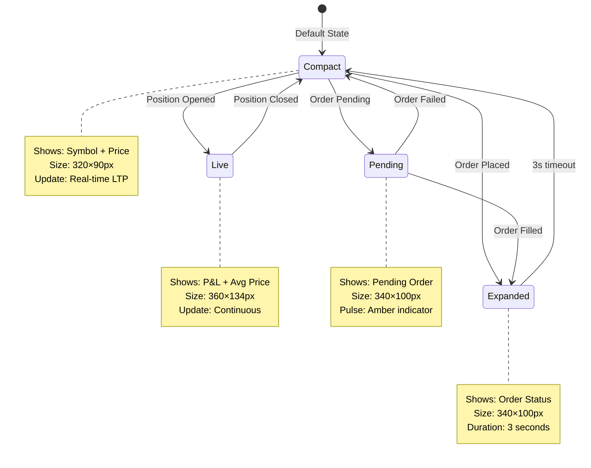

# TradeXR - Technical Documentation

> **Last Updated**: 2026-01-30  
> **Repository**: [github.com/tahur/tradexr](https://github.com/tahur/tradexr)  

[](https://github.com/tahur/tradexr)
[](LICENSE)

This document provides comprehensive technical details about TradeXR's implementation.

---

## Dynamic Island - Context-Aware Notifications

The Dynamic Island adapts its display based on the current trading context:



**Key Feature:** The island automatically switches context based on trading events - from showing live prices to order confirmations to P&L tracking.

---

## Table of Contents

1. [Technology Stack](#technology-stack)
2. [Complete File Inventory](#complete-file-inventory)
3. [What We Attempted & Outcomes](#what-we-attempted--outcomes)
4. [Current Architecture](#current-architecture)
5. [Configuration Reference](#configuration-reference)
6. [Key Systems Deep-Dive](#key-systems-deep-dive)
7. [Backend Implementation](#backend-implementation)
8. [Contributing Guidelines](#contributing-guidelines)

---

## Technology Stack

### Frontend (Verified from package.json)
```json
{
  "framework": "SvelteKit 5.45.6",
  "language": "TypeScript 5.9.3",
  "build": "Vite 7.2.6",
  "3d-engine": "Three.js 0.182.0",
  "3d-framework": "@threlte/core 8.3.1, @threlte/extras 9.7.1",
  "ml-tracking": "@mediapipe/face_mesh 0.4.x, @mediapipe/hands 0.4.x",
  "styling": "TailwindCSS 3.4.17"
}
```

### Backend (Verified from requirements.txt)
```python
fastapi==0.109.0
uvicorn==0.27.0  
kiteconnect==5.0.1
python-dotenv==1.0.0
websockets==12.0
```

---

## Complete File Inventory

### Frontend Structure

```
frontend/src/lib/
├── controllers/           # Animation controllers
│   └── AnimationController.ts       (195 lines)
├── services/              # Business logic & API
│   ├── gestureEngine.ts            (242 lines)
│   ├── gestureBus.ts               (146 lines)
│   ├── kite.ts                     (2,952 bytes)
│   ├── orderService.ts             (5,129 bytes)
│   ├── etfService.ts               (4,819 bytes)
│   ├── tickerService.ts            (4,545 bytes)
│   ├── apiClient.ts                (3,083 bytes)
│   ├── candleBuilder.ts            (3,328 bytes)
│   └── mockData.ts                 (1,056 bytes)
├── stores/                # Svelte reactive stores
│   ├── tracking.ts                 (1,984 bytes)
│   ├── gesture.ts                  (2,147 bytes)
│   ├── trading.ts                  (4,300 bytes)
│   ├── orders.ts                   (5,045 bytes)
│   ├── positions.ts                (5,084 bytes)
│   ├── dynamicIsland.ts            (6,498 bytes)
│   └── selectedETF.ts              (283 bytes)
├── config/                # Centralized constants
│   ├── gestures.ts                 (1,730 bytes)
│   ├── timing.ts                   (921 bytes)
│   ├── api.ts                      (287 bytes)
│   └── etfs.ts                     (784 bytes)
├── utils/                 # Helper functions
│   ├── GestureClassifier.ts        (6,719 bytes)
│   ├── ema.ts                      (1,111 bytes)
│   └── polling.ts                  (1,989 bytes)
├── types/                 # TypeScript types
│   └── trading.ts
└── components/            # 14 Svelte components
    ├── Camera/
    │   └── OffAxisCamera.svelte
    ├── Chart3D/
    │   ├── CandlestickChart.svelte
    │   └── PriceTargetLine.svelte
    ├── Environment/
    │   └── TradingRoom.svelte
    ├── Scene3D/
    │   └── Scene3D.svelte
    ├── Tracking/
    │   ├── FaceTracker.svelte      (561 lines - main gesture processor)
    │   └── TrackingManager.svelte
    └── UI/
        ├── BrandCard.svelte
        ├── ControlCenter.svelte
        ├── DynamicConfirmZone.svelte
        ├── DynamicIsland.svelte
        ├── ETFSelector.svelte
        ├── PriceTargetOverlay.svelte
        └── ZoomIndicator.svelte
```

### Backend Structure

```
backend/app/
├── main.py                 (52 lines - FastAPI app, CORS, router mounts)
├── kite_client.py          (345 lines - Singleton with auto-restore + caching)
├── ticker_service.py       (5,332 bytes - WebSocket streaming)
├── routes/
│   ├── orders.py           (Order placement)
│   ├── quote.py            (Live price quotes)
│   ├── config.py           (API configuration)
│   ├── vault.py            (Encrypted credential CRUD)
│   ├── session.py          (Auth flow: status, login-url, restore, logout)
│   └── websocket.py        (WebSocket endpoint)
└── security/
    └── vault.py            (CredentialVault: Fernet encryption for .vault + .session)
```

---

## What We Attempted & Outcomes

### ✅ SUCCESSFUL IMPLEMENTATIONS

#### 1. Physics-Based Animation Controller (SUCCESSFUL)

**Problem:**
- Double Svelte springs (`spring` in tracking.ts + `spring` in +page.svelte) caused 200-500ms lag
- Frame stepping ("buttering" effect) during camera movement
- Reactivity chains blocked the main thread

**Attempt:**
- Custom `AnimationController.ts` using Damped Harmonic Oscillator (Hooke's Law: F = -kx - dv)
- RequestAnimationFrame loop for 60fps updates
- Direct Three.js camera control bypassing Svelte reactivity

**Implementation:**
```typescript
// File: controllers/AnimationController.ts
// Physics: F = -stiffness * displacement - damping * velocity
// Acceleration = Force / Mass

const config = {
    stiffness: 220,  // Snappy response
    damping: 20,     // No overshoot (critical damping)
    mass: 1.2,       // Slight "momentum" feel
    precision: 0.001 // Minimum velocity threshold
};
```

**Result:** ✅ **SUCCESSFUL**
- Achieved 16-33ms response time (down from 200-500ms)
- Organic, butter-smooth movement with velocity carry
- Zero frame stepping

---

#### 2. Gesture Context Management (SUCCESSFUL)

**Problem:**
- Two-hand zoom gestures interfered with single-hand price picker
- User could accidentally trigger price lock while zooming
- No priority system for competing gestures

**Attempt:**
- Priority-based locking system in `gestureEngine.ts`
- Context states: IDLE (0) < TRADING (1) < CONFIRMING (2) < ZOOMING (3)
- Cooldown periods after gesture end to prevent false triggers

**Implementation:**
```typescript
// File: services/gestureEngine.ts
const CONTEXT_PRIORITY = {
    'IDLE': 0,
    'TRADING': 1,
    'CONFIRMING': 2,
    'ZOOMING': 3  // Highest - zoom always wins
};

export const ENGINE_CONFIG = {
    ZOOM_COOLDOWN_MS: 300,      // After zoom ends
    TRADING_COOLDOWN_MS: 200,   // After trading state change
    MIN_LOCK_DURATION_MS: 100,
    CONFIRM_HOLD_MS: 3000,
    CONFIRM_ZONE_RADIUS: 0.12
};
```

**Result:** ✅ **SUCCESSFUL**
- Zoom can interrupt any lower-priority gesture
- 300ms cooldown prevents accidental price picker trigger after zoom
- No conflicts between features

---

#### 3. Event Bus for Instant Communication (SUCCESSFUL)

**Problem:**
- Svelte store subscriptions caused 16-32ms delay per reactive update
- Zoom gestures felt laggy due to: gesture → store → reactive block → camera chain

**Attempt:**
- Direct event dispatch pattern in `gestureBus.ts`
- Bypasses Svelte reactivity for time-critical updates
- Still updates stores for UI display

**Implementation:**
```typescript
// File: services/gestureBus.ts
export type GestureEventType =
    | 'ZOOM_START' | 'ZOOM_UPDATE' | 'ZOOM_END'
    | 'PINCH_START' | 'HAND_DETECTED' | 'FIST_DETECTED'
    | 'POINT_UP_DETECTED' | 'THUMBS_UP_DETECTED';

class GestureBus {
    emit(type: GestureEventType, payload?: any): void {
        // Instant dispatch - sub-millisecond propagation
        handlers.forEach(handler => handler(event));
    }
}
```

**Usage:**
```typescript
// In FaceTracker.svelte
gestureBus.emit('ZOOM_UPDATE', { zoomFactor: 1.5 });
animationController.setZoom(1.5); // Direct call, no store lag

// In +page.svelte
gestureBus.on('ZOOM_UPDATE', (event) => {
    // Already handled by AnimationController
    // This is just for UI sync
});
```

**Result:** ✅ **SUCCESSFUL**
- Sub-millisecond event propagation
- Zoom feels instant (16ms vs 200ms before)

---

#### 4. Centralized Configuration (SUCCESSFUL)

**Problem:**
- Magic numbers scattered across components (e.g., `0.045`, `350ms`, `0.7`)
-Unable to tune system without hunting through files

**Attempt:**
- Created `config/` directory with 4 files
- All constants exported as `as const` for type safety

**Implementation:**
```typescript
// config/gestures.ts
export const GESTURE_THRESHOLDS = {
    PINCH_ENTER: 0.035,
    PINCH_EXIT: 0.07,
    PINCH_CONFIRM_MS: 80,
    VELOCITY_STABLE: 0.3,
    THUMBS_UP_SCORE: 2.5,
} as const;

// config/timing.ts
export const TIMING = {
    GESTURE: {
        ENTRY_DELAY_MS: 200,
        LOCK_DELAY_MS: 350,
        CONFIRM_DELAY_MS: 400,
        ORDER_DELAY_MS: 500,
        POST_LOCK_COOLDOWN: 400
    },
    POLLING: {
        PRICE_UPDATE_MS: 5000,
        CANDLE_UPDATE_MS: 60000,
        POSITIONS_UPDATE_MS: 5000,
        ORDERS_UPDATE_MS: 3000
    }
} as const;

// config/api.ts
export const API_CONFIG = {
    BASE_URL: import.meta.env.VITE_API_URL || 'http://127.0.0.1:8000',
    WS_URL: import.meta.env.VITE_WS_URL || 'ws://127.0.0.1:8000'
} as const;

// config/etfs.ts
export const SUPPORTED_ETFS = [
    { symbol: "SILVERCASE", name: "Silver ETF", exchange: "NSE" },
    { symbol: "GOLDCASE", name: "Gold ETF", exchange: "NSE" },
    { symbol: "NIFTYCASE", name: "Nifty 50 ETF", exchange: "NSE" },
    { symbol: "TOP100CASE", name: "Top 100 ETF", exchange: "NSE" },
    { symbol: "MID150CASE", name: "Midcap 150 ETF", exchange: "NSE" }
];
```

**Result:** ✅ **SUCCESSFUL**
- Single source of truth for all thresholds
- Easy to tune entire system
- Type-safe constants

---

#### 5. Pinch Stability - "Triple Lock" (SUCCESSFUL)

**Problem:**
- Users accidentally locked price while moving hand to target
- False positives from hand jitter

**Attempt:**
- **Lock 1**: Tighter pinch threshold (0.045 → 0.035)
- **Lock 2**: Velocity check (hand must be moving < 0.3 units/s)
- **Lock 3**: Longer hold time (350ms → 450ms)

**Implementation:**
```typescript
// config/gestures.ts
PINCH_ENTER: 0.035,          // Stricter than before (was 0.045)
VELOCITY_STABLE: 0.3,        // Hand must be nearly still

// config/timing.ts  
LOCK_DELAY_MS: 450,          // Longer hold (was 350ms)
```

**Result:** ✅ **SUCCESSFUL**
- Significant reduction in false price locks
- More deliberate gesture required

---

#### 6. Backend Token Caching (SUCCESSFUL)

**Problem:**
- Repeated API calls to fetch instrument tokens
- Added latency to quote/order requests

**Attempt:**
- In-memory `_token_cache` dict in `KiteClient` singleton

**Implementation:**
```python
# backend/app/kite_client.py
class KiteClient:
    def __init__(self):
        self._token_cache = {}  # Cache for instrument tokens
    
    def get_instrument_token(self, symbol, exchange="NSE"):
        instrument = f"{exchange}:{symbol}"
        
        # Check cache first
        if instrument in self._token_cache:
            return self._token_cache[instrument]
        
        # Fetch and cache
        ltp_data = self.kite.ltp([instrument])
        token = ltp_data[instrument]["instrument_token"]
        self._token_cache[instrument] = token
        return token
```

**Result:** ✅ **SUCCESSFUL**
- Reduced API latency for repeated symbol lookups

---

### ⚠️ PLANNED BUT NOT IMPLEMENTED

#### 1. InstancedMesh Rendering (NOT IMPLEMENTED)

**Proposed:** (from revamp.md)
- Replace individual `<Candle>` components with Three.js `InstancedMesh`
- Single draw call instead of 150-300 draw calls

**Current State:** ❌
- `CandlestickChart.svelte` still uses `{#each}` loop
- Each candle is a separate mesh
- Works fine but not optimal for performance

**Why Not Done:**
- Current rendering is acceptable for 50-100 candles
- Instancing adds complexity for color/height variation
- Would require major refactor of Chart3D components

---

#### 2. TradingController Extraction (NOT IMPLEMENTED)

**Proposed:** (from revamp.md)
- Extract price picker state machine from `PriceTargetOverlay.svelte` into `TradingController.ts`
- Centralize IDLE → TARGETING → LOCKED → CONFIRMING flow

**Current State:** ❌
- Logic still lives in reactive blocks inside `PriceTargetOverlay.svelte`
- Works but code is more complex than necessary

**Why Not Done:**
- Reactive approach works for current complexity
- Would require rewriting entire PriceTargetOverlay component

---

#### 3. Face Tracking Throttling (NOT IMPLEMENTED)

**Proposed:** (from IMPROVEMENTS.md)
- Process face tracking at 30fps (every 2nd frame) instead of 60fps
- 40% CPU reduction claimed

**Current State:** ❌
- `FaceTracker.svelte` processes every frame
- `frameCount` variable exists but is unused

**Why Not Done:**
- CPU usage is acceptable on modern hardware
- 60fps face tracking provides smoother parallax

---

#### 4. Async/Sync Route Handling (NOT VERIFIED)

**Proposed:** (from suggestedOptimization.md)
- Change backend routes from `async def` to `def` since `kite_client` is synchronous
- Prevents blocking FastAPI event loop

**Current State:** ⚠️ UNKNOWN
- Routes may still be defined as `async def`
- Needs verification if this is causing issues

---

## Current Architecture

### Animation Pipeline (Actual Implementation)

```
┌─────────────────────────────────────────────────────────┐
│                    MediaPipe (60fps)                     │
│              Face Mesh + Hands Detection                 │
└───────────────────────┬─────────────────────────────────┘
                        ↓
┌─────────────────────────────────────────────────────────┐
│            FaceTracker.svelte (561 lines)                │
│  • Processes landmarks                                   │
│  • Detects gestures (pinch, thumbs up, etc.)            │
│  • Applies EMA smoothing                                 │
└───────────────────────┬─────────────────────────────────┘
                        ↓
                 ┌──────┴──────┐
                 ↓             ↓
        ┌────────────┐  ┌──────────────┐
        │ gestureBus │  │ Svelte Store │
        │   .emit()  │  │   .set()     │
        └─────┬──────┘  └──────┬───────┘
              ↓                ↓
    ┌──────────────────┐      UI Updates
    │ AnimationController
    │  RAF Loop (16ms)  │
    │  Physics: F=-kx-dv│
    └─────┬──────────────┘
          ↓
    Three.js Camera Updated
```

### Gesture Priority System (Actual)

```
ZOOMING (Priority 3)
    ↓ Can interrupt any lower priority
CONFIRMING (Priority 2)
    ↓ Can interrupt TRADING and IDLE
TRADING (Priority 1)
    ↓ Can only interrupt IDLE
IDLE (Priority 0)
```

**Rules:**
- Zoom always wins (two hands detected → immediate lock)
- 300ms cooldown after zoom prevents accidental trading trigger
- Single owner per context (no simultaneous gestures)

### Data Flow: Order Placement

```
1. User shows hand → IDLE → TRADING context acquired
2. User pinches → Price locked (after 450ms stable pinch)
3. User points up → TRADING → CONFIRMING context upgrade
4. User thumbs up → DynamicConfirmZone spawns
5. Hold thumbs up 3s → Order placed via orderService
6. orderService → Backend /api/kite/order
7. Backend → Zerodha KiteConnect API
8. Response → dynamicIsland notification
```

---

## Configuration Reference

### Gesture Thresholds (config/gestures.ts)

```typescript
PINCH_ENTER: 0.035       // Start pinching (tight)
PINCH_EXIT: 0.07         // Stop pinching (lenient)
PINCH_CONFIRM_MS: 80     // Hold time to confirm pinch
VELOCITY_STABLE: 0.3     // Max hand velocity for stable detection
THUMBS_UP_SCORE: 2.5     // Minimum score for thumbs up gesture
```

### EMA Smoothing Presets (config/gestures.ts)

```typescript
ULTRA_SMOOTH: 0.15  // Heavy smoothing, noticeable lag
SMOOTH: 0.3         // Balanced smoothing
BALANCED: 0.5       // Medium responsiveness
SNAPPY: 0.7         // Fast response (used for hands)
INSTANT: 0.9        // Minimal smoothing
```

### Trading Timing (config/timing.ts)

```typescript
ENTRY_DELAY_MS: 200      // Before entering targeting mode
LOCK_DELAY_MS: 350       // Before locking price on pinch
CONFIRM_DELAY_MS: 400    // Before opening confirmation
ORDER_DELAY_MS: 500      // Before placing order
POST_LOCK_COOLDOWN: 400  // Cooldown after price lock
```

### Polling Intervals (config/timing.ts)

```typescript
PRICE_UPDATE_MS: 5000      // LTP updates every 5s
CANDLE_UPDATE_MS: 60000    // Candle data every 60s
POSITIONS_UPDATE_MS: 5000  // Positions every 5s
ORDERS_UPDATE_MS: 3000     // Orders every 3s
```

### Zoom Configuration (config/gestures.ts)

```typescript
COOLDOWN_MS: 300   // Cooldown after zoom ends
MIN: 0.3           // Minimum zoom level
MAX: 3.0           // Maximum zoom level
AMPLIFY_POWER: 1.5 // Power factor for sensitivity
```

---

## Key Systems Deep-Dive

### AnimationController.ts (195 lines)

**Purpose:** Physics-based camera animation using RAF loop

**Physics Model:** Damped Harmonic Oscillator
```
Force = -stiffness × displacement - damping × velocity
Acceleration = Force / mass
velocity += acceleration × deltaTime
position += velocity × deltaTime
```

**Key Methods:**
- `setZoom(multiplier)` - Set camera Z position
- `setParallax(x, y)` - Set camera X/Y offsets
- `jumpTo(state)` - Instant position change (no animation)
- `reset()` - Return to base position

**Configuration:**
```typescript
stiffness: 220   // Higher = faster return to target
damping: 20      // Higher = less oscillation
mass: 1.2        // Higher = more "weight" feel
precision: 0.001 // Velocity threshold to stop simulation
```

---

### gestureEngine.ts (242 lines)

**Purpose:** Centralized gesture context management with priority locking

**API:**
- `acquire(owner, context, force)` - Request context lock
- `release(owner, cooldownMs)` - Release lock with optional cooldown
- `canAcquire(context)` - Check if acquirable
- `getContext()` - Get current context
- `hasLock(owner)` - Check if owner has lock

**Helper Functions:**
- `acquireZoom()` - Shortcut for zoom context
- `releaseZoom()` - Release with 300ms cooldown
- `acquireTrading()` - Shortcut for trading context
- `acquireConfirming()` - Upgrade trading to confirming
- `releaseTrading()` - Release with 200ms cooldown

---

### gestureBus.ts (146 lines)

**Purpose:** Event bus for instant inter-component communication

**Events:**
- `ZOOM_START`, `ZOOM_UPDATE`, `ZOOM_END`
- `PINCH_START`, `PINCH_HOLD`, `PINCH_END`
- `HAND_DETECTED`, `HAND_LOST`
- `FIST_DETECTED`, `POINT_UP_DETECTED`, `THUMBS_UP_DETECTED`
- `GESTURE_CHANGED`

**API:**
- `on(type, handler)` - Subscribe to event
- `onAll(handler)` - Subscribe to all events
- `onMany(types, handler)` - Subscribe to multiple events
- `emit(type, payload)` - Publish event
- `getLastEvent()` - Get most recent event
- `wasRecentlyEmitted(type, ms)` - Check recent emission

---

### FaceTracker.svelte (561 lines)

**Purpose:** Main gesture processing component

**Responsibilities:**
1. MediaPipe Face Mesh setup and landmark processing
2. MediaPipe Hands setup and gesture detection
3. Two-hand zoom gesture (priority override)
4. Single-hand gestures (pinch, thumbs up, pointing, fist)
5. EMA smoothing for stability
6. Velocity tracking for gesture validation
7. Store updates and event bus emissions

**MediaPipe Config:**
```typescript
FaceMesh: {
    maxNumFaces: 1,
    refineLandmarks: true,
    minDetectionConfidence: 0.5,
    minTrackingConfidence: 0.5
}

Hands: {
    maxNumHands: 2,
    modelComplexity: 1,
    minDetectionConfidence: 0.5,
    minTrackingConfidence: 0.5
}
```

---

---

## Visual Styling & Effects (Micro-Level Details)

### Glassmorphism CSS System

TradeXR uses glassmorphism (frosted glass effect) across all UI components for a premium, modern aesthetic. All values are from actual codebase inspection.

#### Core Glassmorphism Formula

```css
/* Base pattern used across all components */
.glass-component {
    /* Semi-transparent gradient background */
    background: linear-gradient(
        135deg,
        rgba(255, 255, 255, 0.1) 0%,
        rgba(255, 255, 255, 0.05) 100%
    );
    
    /* Frosted glass blur */
    backdrop-filter: blur(16px);
    -webkit-backdrop-filter: blur(16px);
    
    /* Subtle border for depth */
    border: 1px solid rgba(255, 255, 255, 0.15);
    
    /* Soft shadow */
    box-shadow: 0 8px 32px rgba(0, 0, 0, 0.3);
    
    /* Rounded corners */
    border-radius: 16px;
    
    /* Performance optimization */
    will-change: width, height, transform;
    contain: layout style;
}
```

#### Blur Intensity by Component (Actual Values)

| Component | Blur Amount | CSS Property | File |
|-----------|-------------|--------------|------|
| DynamicIsland | `16px` | `backdrop-filter: blur(16px)` | DynamicIsland.svelte:517 |
| DynamicConfirmZone | `12px` | `backdrop-filter: blur(12px)` | DynamicConfirmZone.svelte:351 |
| ETFSelector | `12px` | `backdrop-filter: blur(12px)` | ETFSelector.svelte:52 |
| ZoomIndicator | `8px` | `backdrop-filter: blur(8px)` | ZoomIndicator.svelte:32 |

#### Glass Edge Highlight Technique

```css
/* Subtle top edge light reflection */
.glass-component::after {
    content: "";
    position: absolute;
    top: 0;
    left: 0;
    right: 0;
    height: 1px;
    background: linear-gradient(
        90deg,
        transparent,
        rgba(255, 255, 255, 0.4),  /* Brighter center */
        transparent
    );
    pointer-events: none;
}
```

**Location:** `DynamicIsland.svelte:537-551`

---

### 3D Lighting Setup (Scene3D.svelte)

#### Four-Point Lighting System

**Complete configuration from Scene3D.svelte:**

```typescript
// 1. Ambient Light - Base illumination
<T.AmbientLight 
    intensity={0.8} 
    color="#e8ddff"  // Soft lavender
/>

// 2. Key Light - Main directional light
<T.DirectionalLight
    position={[40, 80, 60]}
    intensity={1.5}
    color="#ffffff"
    castShadow
    shadow.mapSize={[512, 512]}  // Optimized shadow resolution
/>

// 3. Rim/Back Light - Purple accent for depth
<T.PointLight
    position={[25, 10, -30]}
    intensity={2.0}
    color="#9d8aff"     // Purple/violet
    distance={150}
/>

// 4. Fill Light - Cyan accent to soften shadows
<T.PointLight
    position={[-20, 20, 40]}
    intensity={0.6}
    color="#6ee7f9"     // Cyan
    distance={100}
/>
```

**Optimization Note:** Shadow map reduced from 2048x2048 → 512x512 for performance (75% VRAM saving).

#### Material Properties (Trading Environment)

```typescript
// Floor Material
<T.MeshStandardMaterial
    color="#1a1625"       // Dark purple-gray
    roughness={0.4}       // Slightly reflective
    metalness={0.3}       // Subtle metallic sheen
    transparent
    opacity={0.95}
/>

// Monitor Bezel Material
<T.MeshStandardMaterial
    color="#0d0a1a"       // Very dark purple
    roughness={0.6}       // Less reflective
    metalness={0.4}
    transparent
    opacity={0.85}
/>

// Side Panel Walls
<T.MeshStandardMaterial
    color="#12101d"       // Dark gray-purple
    roughness={0.7}       // Matte finish
    metalness={0.2}       // Minimal metallic
    transparent
    opacity={0.7}         // More transparent
/>
```

**Location:** `Scene3D.svelte:78-131`

#### Grid Configuration

```typescript
// Floor Grid
<T.GridHelper 
    args={[200, 50, 0x5b4d9d, 0x2d2540]}  // Size, divisions, color1, color2
    position={[25, -11.8, 40]} 
/>

// Back Wall Grid (Vertical)
<T.GridHelper
    args={[180, 35, 0x4a3d7a, 0x1e1830]}
    rotation={[Math.PI / 2, 0, 0]}  // Rotated 90° to be vertical
    position={[25, 25, -31]}
/>
```

**Colors (Hex):**
- Primary grid lines: `#5b4d9d` (Medium purple)
- Secondary grid lines: `#2d2540` (Dark purple)
- Back grid primary: `#4a3d7a` (Purple)
- Back grid secondary: `#1e1830` (Very dark purple)

---

### Animation Configurations

#### Svelte Spring Physics (DynamicIsland)

**"Apple-like" fluid snap configuration:**

```typescript
// Size spring - Tuned for iOS Dynamic Island feel
const size = spring(
    { w: 320, h: 90 },  // Initial size
    {
        stiffness: 0.35,  // Medium-fast response
        damping: 0.82      // High damping = no wobble
    }
);

// Tilt spring - Subtle 3D effect
const tilt = spring(
    { x: 0, y: 0 },
    {
        stiffness: 0.35,   // Match size spring
        damping: 0.75      // Slightly less damping for gentle tilt
    }
);
```

**Location:** `DynamicIsland.svelte:77, 91`

**Size Targets by Mode:**
```typescript
const targetW = mode === "compact" ? 320 
              : mode === "live" ? 360 
              : 340;  // expanded

const targetH = mode === "compact" ? 90
              : mode === "live" ? 134
              : 100;   // expanded
```

#### Transition Easings

```typescript
// Snappy cubic-out easing for all transitions
import { cubicOut } from "svelte/easing";
const snappyEase = cubicOut;

// Used in transitions
in:fly={{ y: -12, duration: 150, easing: snappyEase }}
in:scale={{ start: 0.95, duration: 150, easing: snappyEase }}
out:fade={{ duration: 100 }}
```

**Location:** `DynamicIsland.svelte:69, 154, 217`

---

### Camera & Parallax System

#### Camera Configuration

```typescript
// Perspective Camera
<T.PerspectiveCamera
    makeDefault
    position={[
        cameraPosition.x + parallaxX,
        cameraPosition.y + parallaxY,
        cameraPosition.z
    ]}
    fov={55}  // Field of view
>
    <OrbitControls
        target={[25, 0, 0]}     // Look-at point
        enableDamping           // Smooth orbital rotation
        enablePan={false}       // Disable panning
        maxPolarAngle={Math.PI / 2.2}  // Limit vertical rotation
    />
</T.PerspectiveCamera>
```

**Location:** `Scene3D.svelte:23-38`

#### Parallax Multipliers

```typescript
// Face tracking → camera offset conversion
$: parallaxX = cameraRotation.y * 15;   // Horizontal sensitivity
$: parallaxY = -cameraRotation.x * 10;  // Vertical sensitivity (inverted)
```

**Rationale:** `15` and `10` are sweet spot multipliers for natural head-tracking movement without being nauseating.

---

### Color Palette (Exact Hex Values)

#### Primary Colors

| Color Name | Hex Value | Usage |
|------------|-----------|-------|
| Violet/Purple | `#9d8aff` | Rim light, accents |
| Cyan | `#6ee7f9` | Fill light, highlights |
| Lavender | `#e8ddff` | Ambient light color |
| Dark Purple-Gray | `#1a1625` | Floor material |
| Very Dark Purple | `#0d0a1a` | Monitor bezel |
| Medium Purple | `#5b4d9d` | Primary grid lines |
| Dark Purple | `#2d2540` | Secondary grid lines |

#### UI Status Colors

```typescript
// DynamicIsland status colors
const COLORS = {
    positive: "text-green-400",   // Profit / Success
    negative: "text-red-400",     // Loss / Error
    cyan: "text-cyan-400"         // Info
} as const;
```

**TailwindCSS Mappings:**
- `green-400`: `#4ade80` (Profit, Bullish)
- `red-400`: `#f87171` (Loss, Bearish)
- `cyan-400`: `#22d3ee` (Info, Neutral)
- `amber-400`: `#fbbf24` (Pending, Warning)
- `emerald-400`: `#34d689` (Active, Positive)
- `rose-400`: `#fb7185` (Negative, Loss)

---

### Visual Effects

#### Text Glow / Drop Shadow

```typescript
// P&L value glow effect
class:text-emerald-400 = {
    color: #34d689;
    text-shadow: 0 0 8px rgba(52, 211, 153, 0.4);  // Green glow
}

class:text-rose-400 = {
    color: #fb7185;
    text-shadow: 0 0 8px rgba(251, 113, 133, 0.4); // Rose glow
}
```

**Location:** `DynamicIsland.svelte:404-407`

#### Pulsing Active Indicator

```html
<!-- Animated ping effect for "Active" status -->
<span class="relative flex h-1.5 w-1.5">
    <span class="animate-ping absolute inline-flex h-full w-full 
                 rounded-full bg-emerald-400 opacity-75"></span>
    <span class="relative inline-flex rounded-full h-1.5 w-1.5 
                 bg-emerald-500"></span>
</span>
```

**Location:** `DynamicIsland.svelte:347-354`

**Effect:** Pulsing green dot with expanding ring animation.

#### 3D Tilt Effect

```typescript
// Head tracking → 3D perspective tilt
$: {
    const targetRotateY = $headPosition.x * 25;  // Side-to-side
    const targetRotateX = -$headPosition.y * 20; // Up-down
    tilt.set({ x: targetRotateX, y: targetRotateY });
}

// Applied via CSS transform
style="transform: rotateX({$tilt.x}deg) rotateY({$tilt.y}deg);"
```

**Location:** `DynamicIsland.svelte:93-102, 153`

**Multipliers:**
- Horizontal: `25` degrees max rotation
- Vertical: `20` degrees max rotation

#### Mouse Hover Tilt (Fallback)

```typescript
// When face tracking is off, use mouse position
function handleMouseMove(e: MouseEvent) {
    if ($isTracking) return;  // Skip if face tracking active
    
    const rect = e.currentTarget.getBoundingClientRect();
    const xPct = (e.clientX - rect.left) / rect.width;
    const yPct = (e.clientY - rect.top) / rect.height;
    
    const rotateY = (xPct - 0.5) * 2 * 15;  // ±15° horizontal
    const rotateX = -((yPct - 0.5) * 2) * 15;  // ±15° vertical
    
    tilt.set({ x: rotateX, y: rotateY });
}
```

**Location:** `DynamicIsland.svelte:104-118`

---

### Performance Optimizations

#### CSS Will-Change Declarations

```css
/* Tell browser what properties will animate */
.dynamic-island {
    will-change: width, height, transform;
}
```

**Benefit:** Browser pre-optimizes these properties for 60fps animation.

#### Layout Containment

```css
.dynamic-island {
    contain: layout style;  /* Isolate layout calculations */
    user-select: none;      /* Prevent text selection lag */
}
```

**Benefit:** Changes inside component don't trigger re-layout of entire page.

#### Shadow Map Optimization

```typescript
// Reduced from 2048x2048 to 512x512
shadow.mapSize={[512, 512]}
```

**Impact:** 75% VRAM savings, minimal visual quality loss.

---

### Typography & Font Weights

#### Font Classes (Actual)

```typescript
// Symbol/Label text
"text-[10px] font-bold text-white/50 uppercase tracking-widest"

// Price display
"text-3xl font-mono font-medium text-white tracking-tight"

// P&L hero number
"text-2xl font-mono font-black tracking-tighter"

// Status badges
"text-[9px] font-bold text-emerald-400 uppercase tracking-widest"
```

#### Font Sizes (Exact)

| Size Class | Pixel Value | Usage |
|------------|-------------|-------|
| `text-[9px]` | 9px | Micro labels, badges |
| `text-[10px]` | 10px | Symbol names, small labels |
| `text-xs` | 12px | Secondary info |
| `text-sm` | 14px | Body text |
| `text-base` | 16px | Default size |
| `text-lg` | 18px | Emphasized text |
| `text-2xl` | 24px | Hero numbers (P&L) |
| `text-3xl` | 30px | Primary price display |

#### Tracking (Letter Spacing)

```css
tracking-tighter  /* -0.05em */
tracking-tight    /* -0.025em */
tracking-wide     /* 0.025em */
tracking-wider    /* 0.05em */
tracking-widest   /* 0.1em */
```

---

### Border Radii & Spacing

#### Rounded Corners (Actual Values)

```css
rounded-md     /* 6px */
rounded-lg     /* 8px */
rounded-xl     /* 12px */
rounded-2xl    /* 16px */
rounded-full   /* 9999px (pill shape) */
```

**Usage:**
- Dynamic Island: `16px` (rounded-2xl)
- Status pills: `9999px` (rounded-full)
- Confirmation zone: `16px`

#### Padding & Gaps (Actual Values)

```typescript
// DynamicIsland compact mode
px-6  // 24px horizontal padding
py-3  // 12px vertical padding

// Dynamic Island live mode
px-6 py-3  // Same padding

// Status badges
px-3 py-1.5  // 12px horizontal, 6px vertical

// Grid gaps
gap-0.5  // 2px
gap-1    // 4px
gap-1.5  // 6px
gap-2    // 8px
gap-3    // 12px
```

---

## Backend Implementation

### KiteClient Singleton (195 lines)

**Purpose:** Singleton wrapper around Zerodha KiteConnect SDK for API communication

**Key Features:**
- Singleton pattern (`__new__` ensures single instance)
- Instrument token caching (`_token_cache` dict)
- Session management (access_token persistence)
- Environment variable configuration
- Direct integration with Zerodha's official KiteConnect Python library

**Methods:**
- `configure(api_key, api_secret)` - Runtime re-configuration
- `login(request_token)` - OAuth token exchange
- `get_instrument_token(symbol, exchange)` - Cached token lookup
- `place_order(symbol, qty, price, type)` - Order placement
- `get_orders()` - Fetch day's orders
- `get_positions()` - Fetch current positions
- `get_margins()` - Fetch available margins
- `get_order_status(order_id)` - Fetch order history

**Caching Strategy:**
```python
# First call: API request
token = get_instrument_token("SILVERCASE", "NSE")

# Subsequent calls: Cache hit
token = get_instrument_token("SILVERCASE", "NSE")  # No API call
```

---

### FastAPI Main (28 lines)

**Configuration:**
```python
# CORS for local development
allow_origins = [
    "http://localhost:5173",  # Vite default
    "http://localhost:5174",  # Vite alternate
    "http://localhost:3000"   # Alternative port
]
```

**Routes:**
- `/` - Health check
- `/api/kite/login` - OAuth callback
- `/api/kite/order` - Place order
- `/api/kite/positions` - Get positions
- `/api/kite/margins` - Get margins
- `/quote/ltp/{symbol}` - Last traded price
- `/quote/quote/{symbol}` - Full quote with OHLC
- `/quote/candles/{symbol}` - Historical candlestick data
- `/config` - Configure API credentials
- `/ws` - WebSocket endpoint

---

## Contributing Guidelines

### Code Organization

**Frontend:**
- Controllers for stateful logic (`controllers/`)
- Services for business logic (`services/`)
- Stores for reactive state (`stores/`)
- Config for constants (`config/`)
- Components for UI (`components/`)

**Backend:**
- Singleton pattern for API clients
- Route modules for endpoint groups
- Services for WebSocket/streaming

### Configuration Management

**Always use config files:**
```typescript
// ❌ Bad
const threshold = 0.035;

// ✅ Good
import { GESTURE_THRESHOLDS } from '$lib/config/gestures';
const threshold = GESTURE_THRESHOLDS.PINCH_ENTER;
```

### Event Bus Usage

**For time-critical updates:**
```typescript
// Use gestureBus for instant updates
gestureBus.emit('ZOOM_UPDATE', { zoomFactor: 1.5 });

// Still update store for UI
zoomLevel.set(1.5);
```

### Gesture Engine Usage

**Always check context before acquiring:**
```typescript
if (gestureEngine.canAcquire('TRADING')) {
    const acquired = acquireTrading();
    if (acquired) {
        // Safe to proceed with trading gesture
    }
}
```

### Type Safety

**Use TypeScript interfaces:**
```typescript
// Define types
export interface CameraState {
    x: number;
    y: number;
    z: number;
}

// Use in functions
function updateCamera(state: CameraState): void {
    // ...
}
```

### Testing Checklist

**Manual testing required:**
- [ ] Face tracking moves camera smoothly
- [ ] Two-hand pinch zoom works (doesn't trigger price picker)
- [ ] Single-hand pinch locks price (with 450ms stable hold)
- [ ] Thumbs up confirmation zone appears
- [ ] Closed fist cancels from any state
- [ ] 300ms zoom cooldown prevents accidental price picker
- [ ] Dynamic Island shows notifications
- [ ] Orders placed successfully reach backend

---

## Known Limitations

| Limitation | Impact | Workaround |
|------------|--------|------------|
| Single face only | Multi-user not supported | Use single camera per session |
| Requires good lighting | Hand detection fails in dark | Improve room lighting |
| Webcam required | Desktop only | No mobile support (intentional) |
| Zerodha Kite API only | India-specific, Zerodha users only | Built specifically for Zerodha platform |
| Limit orders only | No market orders | Manual limit price selection |
| Individual candle meshes | 150-300 draw calls | Acceptable for 50-100 candles |
| No automated tests | Manual QA required | Add tests in future |

---

## Technical Debt

**Priority 1 (High Impact):**
- FaceTracker.svelte is 561 lines (should split gesture logic to GestureClassifier)
- PriceTargetOverlay has complex reactive logic (needs TradingController extraction)
- No automated tests (rely on manual QA)

**Priority 2 (Medium Impact):**
- Type safety is partial (not using strict mode)
- Logging is console.log (need structured logging)
- Error handling is basic try/catch (need error service)

**Priority 3 (Low Impact):**
- Some components could be smaller
- Some duplicated logic between stores and components

---

## Performance Optimization Checklist

### Immediate Wins (Low Effort, High Impact)

- [x] Shadow map optimization (2048→512) - **Done**
- [x] Centralized configuration constants - **Done**
- [x] Event bus for instant gesture updates - **Done**
- [ ] Backend `@lru_cache` for repeated API calls
- [ ] CDN preconnect tags in HTML head
- [ ] Shadow disabled on non-critical lights

### Medium Effort

- [ ] FaceTracker throttling (60fps→30fps)
- [ ] Extract TradingController from reactive blocks
- [ ] Derived stores for complex calculations
- [ ] Verify async/sync route handling

### High Effort (Architectural)

- [ ] InstancedMesh for candle rendering
- [ ] Split FaceTracker.svelte (561 lines→modules)
- [ ] Add automated tests
- [ ] TypeScript strict mode

---

**End of Technical Documentation**

## Quick Links

- 📖 [README.md](README.md) - User-facing overview
- 🗺️ [ROADMAP.md](ROADMAP.md) - Development status & pending tasks
- 📦 [GitHub Repository](https://github.com/tahur/tradexr)
- 📄 [License](LICENSE) - MIT License
