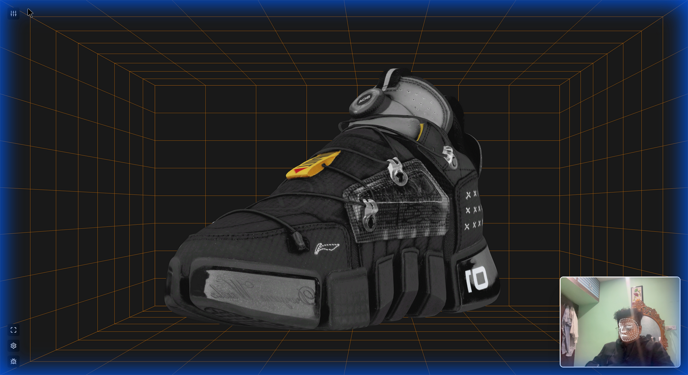
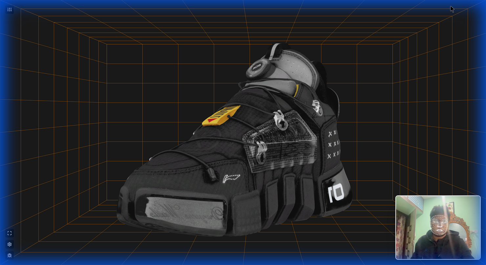
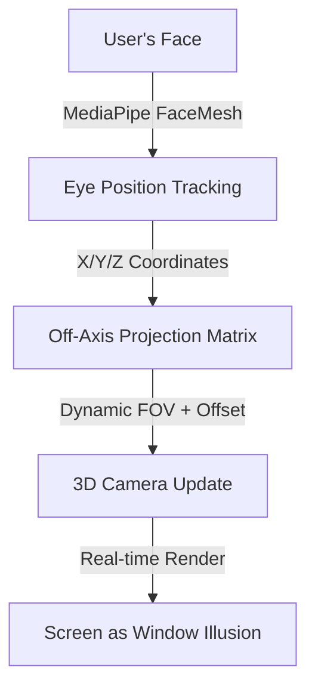
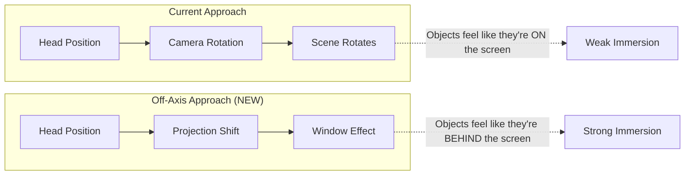

# 🔬 Off-Axis Sneaker Research: Applying Immersive 3D to HoloTrade

> **Source**: [Off-Axis Sneaker Experience](http://off-axis-sneaker.bolt.host)  
> **Goal**: Extract key techniques to revamp HoloTrade's candlestick chart with the same "window into 3D space" immersion.

---

## 📸 Reference Screenshots

````carousel

<!-- slide -->

````


---

## 🎯 Core Concept: Off-Axis Projection

The sneaker site's innovation is **Off-Axis Projection** (also called anamorphic 3D or head-coupled perspective). Instead of a static 3D view, the screen becomes a **"portal"** or **"window"** into a virtual space.



### How It Works
1. **Face Tracking**: MediaPipe FaceMesh tracks 468 facial landmarks in real-time
2. **Eye Position**: Extract the nose/eye center position relative to screen center
3. **Off-Axis Camera**: Instead of centering the camera frustum, **offset it based on head position**
4. **Parallax Effect**: Objects appear to have physical depth - move your head left, see the right side of the object

> [!IMPORTANT]
> The key insight is that **the camera doesn't rotate** - it stays pointing forward. Only the **projection frustum shifts** based on head position. This is fundamentally different from our current HoloTrade implementation which rotates the camera.

---

## 🛠️ Technical Implementation

### 1. Face Tracking (MediaPipe FaceMesh)
The site loads MediaPipe directly via CDN:

```html
<script src="https://cdn.jsdelivr.net/npm/@mediapipe/camera_utils/camera_utils.js"></script>
<script src="https://cdn.jsdelivr.net/npm/@mediapipe/face_mesh/face_mesh.js"></script>
```

**Key Landmarks Used:**
| Landmark Index | Purpose |
|----------------|---------|
| 1 | Nose tip (center reference) |
| 33, 263 | Left/Right eye outer corners |
| 168 | Forehead center (for Z depth) |

### 2. Off-Axis Projection Math

The magic happens in the **projection matrix calculation**. Traditional perspective uses a symmetric frustum, but off-axis uses an **asymmetric frustum**:

```javascript
// Traditional (symmetric)
camera.fov = 75;
camera.lookAt(scene.center);

// Off-Axis (asymmetric) - what the sneaker site does
function updateOffAxisProjection(eyeX, eyeY, eyeZ) {
    const near = 0.1;
    const far = 1000;
    const screenWidth = 0.5; // meters (estimated screen width)
    const screenHeight = screenWidth / aspect;
    
    // Eye position relative to screen center
    const left = (-screenWidth/2 - eyeX) * near / eyeZ;
    const right = (screenWidth/2 - eyeX) * near / eyeZ;
    const bottom = (-screenHeight/2 - eyeY) * near / eyeZ;
    const top = (screenHeight/2 - eyeY) * near / eyeZ;
    
    camera.projectionMatrix.makePerspective(left, right, bottom, top, near, far);
}
```

### 3. The "Box" Environment

The wireframe grid box serves **two critical purposes**:

1. **Depth Anchoring**: The converging lines provide strong perspective cues
2. **Peripheral Reference**: Even when focused on the sneaker, the lines in peripheral vision reinforce the 3D illusion

```
        ┌─────────────────────────────────────┐
        │╲                                   ╱│
        │ ╲          SCREEN IS A           ╱ │
        │  ╲         WINDOW INTO          ╱  │
        │   ╲        THIS SPACE          ╱   │
        │    ╲═══════════════════════════╱    │
        │     ║                         ║     │
        │     ║    🔵 3D OBJECT         ║     │
        │     ║                         ║     │
        │    ╱═══════════════════════════╲    │
        │   ╱                             ╲   │
        │  ╱                               ╲  │
        │ ╱                                 ╲ │
        │╱                                   ╲│
        └─────────────────────────────────────┘
```

### 4. UI Elements

| Element | Position | Purpose |
|---------|----------|---------|
| Face Tracking PiP | Bottom-right | Shows user their face is being tracked |
| Control Buttons | Top corners | Shoe Controls, Calibration, Debug, Fullscreen |
| Blue Frame Border | Edge of screen | Reinforces "window" metaphor |
| Grid Lines | Background | Orange wireframe for depth perception |

---

## 🎨 Visual Design Analysis

### Color Palette
| Element | Color | Hex |
|---------|-------|-----|
| Background | Dark Navy | `#0a0a14` |
| Grid Lines | Orange/Amber | `#ff8c00` |
| Frame Border | Electric Blue | `#00a2ff` |
| UI Elements | Semi-transparent White | `rgba(255,255,255,0.8)` |

### Styling Techniques
- **High contrast**: Dark background makes the 3D object "pop"
- **Glowing borders**: Blue neon effect on screen edges
- **Minimal UI**: Controls are subtle, don't distract from immersion
- **PBR Materials**: Sneaker has realistic leather, mesh, and plastic textures

---

## 🔄 Applying to HoloTrade Candlestick Charts

### Current vs. Proposed Approach

| Aspect | Current HoloTrade | Proposed (Off-Axis) |
|--------|-------------------|---------------------|
| Camera Movement | Rotate camera based on head | Shift projection frustum |
| Depth Illusion | Weak, objects rotate | Strong, "window" effect |
| Background | None / flat grid | Wireframe "trading room" |
| Face Tracking | MediaPipe position → camera rotation | MediaPipe position → off-axis matrix |

### Proposed Changes

#### 1. Create "Trading Room" Environment
Instead of floating candlesticks, place them **inside a 3D room**:

```
         ┌────────────────────────────────────────┐
        ╱│                                       ╱│
       ╱ │      ╭─╮ ╭─╮     ╭─╮              ╱ │
      ╱  │      │▓│ │ │ ╭─╮ │▓│             ╱  │
     ╱   │   ╭─╮│▓│ │ │ │ │ │▓│ ╭─╮       ╱   │  ← PRICE AXIS
    ╱    │   │▓││▓│ │ │ │ │ │▓│ │▓│ ╭─╮  ╱    │
   ║─────┼───┼─┼┼─┼─┼─┼─┼─┼─┼─┼─┼─┼─┼─┼─║─────│
   ║     │   FLOOR GRID (TIME AXIS)    ║      │
   ║     │                              ║      │
   ╚═════╧══════════════════════════════╝══════╧
         
         ← Screen acts as window into this space →
```

#### 2. Implement Off-Axis Camera

Replace current camera movement with off-axis projection:

```typescript
// stores/tracking.ts - NEW implementation
function updateCameraProjection(headX: number, headY: number, headZ: number) {
    // Assume user sits ~60cm from screen
    const eyeZ = headZ > 0 ? headZ : 0.6;
    
    // Map head position to meters (-0.3 to 0.3 range)
    const eyeX = headX * 0.3;
    const eyeY = headY * 0.2;
    
    // Calculate asymmetric frustum
    const screenHalfWidth = 0.4; // 40cm display
    const screenHalfHeight = screenHalfWidth / aspectRatio;
    
    const near = 0.1;
    const left = (-screenHalfWidth - eyeX) * near / eyeZ;
    const right = (screenHalfWidth - eyeX) * near / eyeZ;
    const bottom = (-screenHalfHeight - eyeY) * near / eyeZ;
    const top = (screenHalfHeight - eyeY) * near / eyeZ;
    
    camera.projectionMatrix.makePerspective(left, right, bottom, top, near, 1000);
}
```

#### 3. Add Visual Anchors

| Element | Implementation |
|---------|----------------|
| Floor Grid | Three.js GridHelper with orange material |
| Room Walls | Wireframe planes with high transparency |
| Price Axis | Vertical ruler on left wall |
| Time Axis | Labels on floor grid |
| Glowing Frame | CSS border with box-shadow glow |

#### 4. Calibration System

Add a calibration step for users to set their:
- Distance from screen
- Screen size
- Tracking sensitivity

---

## 📋 Implementation Checklist

### Phase 1: Environment Setup
- [ ] Create `TradingRoom.svelte` component with wireframe walls
- [ ] Add floor grid with orange color scheme  
- [ ] Position candlesticks inside the room
- [ ] Add glowing blue border frame around viewport

### Phase 2: Off-Axis Camera
- [ ] Modify `tracking.ts` to calculate asymmetric frustum
- [ ] Replace camera rotation with projection matrix update
- [ ] Add smoothing/lerp to prevent jitter
- [ ] Test depth illusion effect

### Phase 3: UI Polish
- [ ] Add face tracking PiP window
- [ ] Create calibration modal
- [ ] Add sensitivity controls
- [ ] Implement debug mode overlay

### Phase 4: Integration
- [ ] Combine with existing gesture controls
- [ ] Test with order placement flow
- [ ] Performance optimization
- [ ] User testing

---

## 🎥 Key Differences Summary



The fundamental shift is from **"3D content on a screen"** to **"screen as a window into 3D space"**.

---

## 📚 Resources

- [Off-Axis Projection Explained (YouTube)](https://www.youtube.com/watch?v=Jd3-eiid-Uw)
- [Three.js Asymmetric Frustum](https://threejs.org/docs/#api/en/cameras/PerspectiveCamera)
- [MediaPipe Face Mesh](https://mediapipe.readthedocs.io/en/latest/solutions/face_mesh.html)
- [Johnny Lee's Head Tracking Research](https://johnnylee.net/projects/wii/)

---

*Research completed: January 10, 2026*
