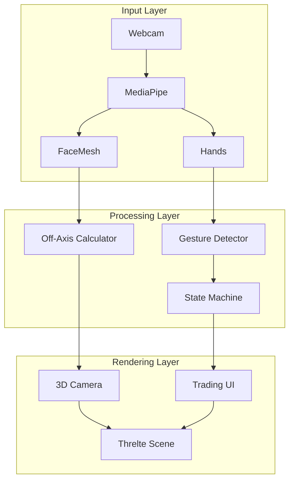
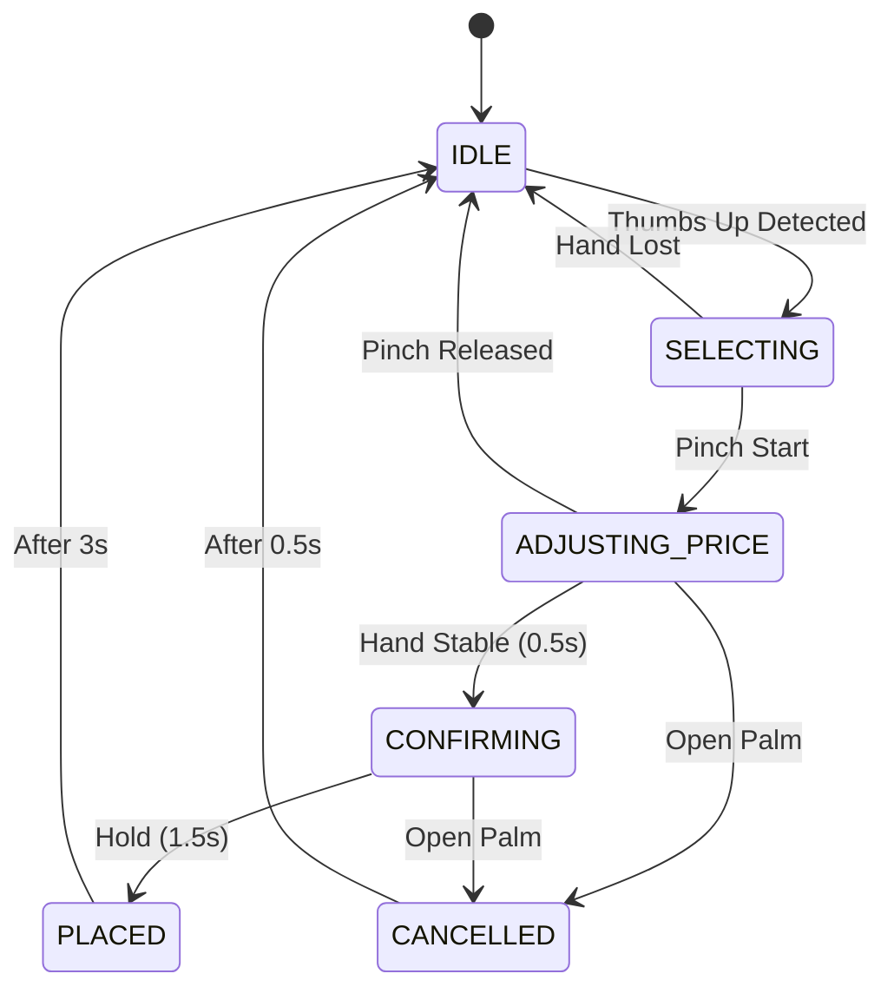
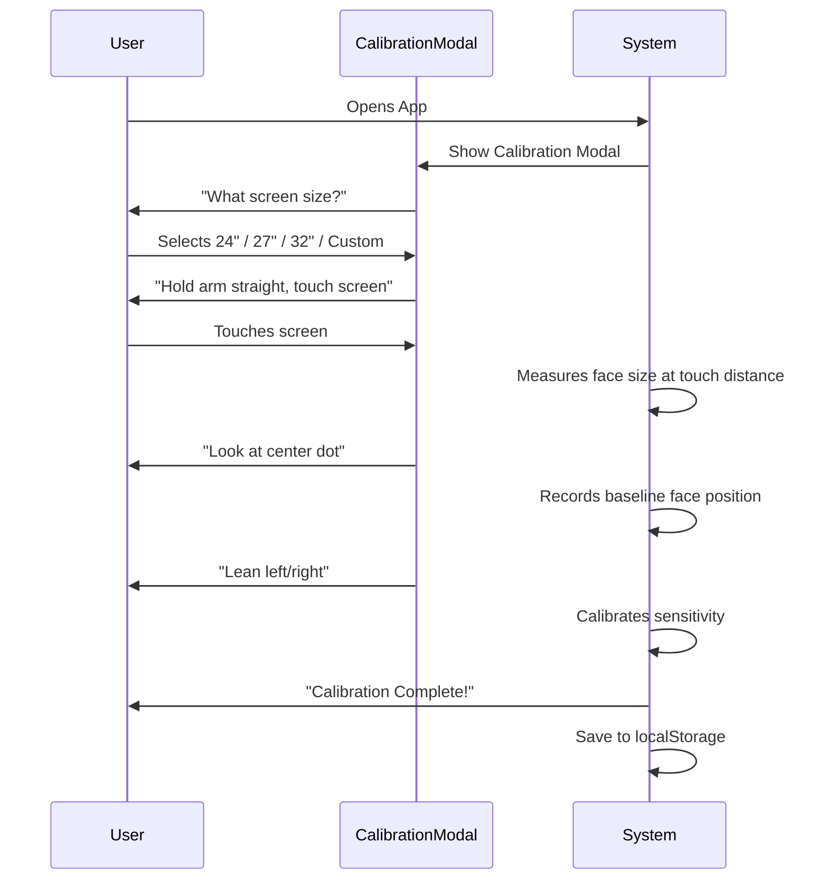

# 🔧 Technical Implementation Specification
## Off-Axis Projection + Enhanced Gesture Interactions

> **Document Type**: Technical Specification  
> **Project**: HoloTrade - Immersive 3D Trading Interface  
> **Date**: January 10, 2026

---

## 📋 Executive Summary

This document outlines the technical implementation for two major enhancements:

1. **Off-Axis Projection**: Transform from camera rotation to asymmetric frustum projection
2. **Enhanced Gesture System**: Improve reliability, add new gestures, and reduce false positives

---

## 🏗️ Architecture Overview



---

# Part 1: Off-Axis Projection Implementation

## 1.1 Current vs. Proposed Approach

| Aspect | Current Implementation | Proposed Implementation |
|--------|------------------------|------------------------|
| **Camera Movement** | Rotates based on `headPosition` | Fixed orientation, shifted frustum |
| **Projection** | Symmetric (standard `PerspectiveCamera`) | Asymmetric (`makePerspective()`) |
| **Depth Illusion** | Weak - scene rotates | Strong - "window" effect |
| **Coordinate System** | Head X/Y → Camera rotation | Head X/Y/Z → Frustum offset |

## 1.2 Mathematical Foundation

### Standard Perspective (Current)
```
         Left                 Right
           |←───────FOV───────→|
            \                 /
             \    Camera     /
              \    looks    /
               \   here    /
                \         /
                 \       /
                  \     /
                   \   /
                    \ /
                     * ← Camera Position (moves)
```

### Off-Axis Perspective (Proposed)
```
    Screen Edge            Screen Edge
         |                       |
         |      User Eye         |
         |         *             |
         |        / \            |
         |       /   \           |
         |      /     \          |
         |     /       \         |
         |    /  SKEWED \        |
         |   /  FRUSTUM  \       |
         |  /             \      |
         | /               \     |
         |/                 \    |
    ─────┴───────────────────┴─────
              Virtual Scene
```

### Core Formula

```typescript
// Off-Axis Frustum Calculation
function calculateOffAxisFrustum(
    eyeX: number,      // Eye position X (meters from center)
    eyeY: number,      // Eye position Y (meters from center)
    eyeZ: number,      // Eye distance from screen (meters)
    screenWidth: number,  // Physical screen width (meters)
    aspectRatio: number,
    near: number = 0.1,
    far: number = 1000
): FrustumBounds {
    const screenHeight = screenWidth / aspectRatio;
    const halfWidth = screenWidth / 2;
    const halfHeight = screenHeight / 2;
    
    return {
        left:   (-halfWidth - eyeX) * near / eyeZ,
        right:  (halfWidth - eyeX) * near / eyeZ,
        bottom: (-halfHeight - eyeY) * near / eyeZ,
        top:    (halfHeight - eyeY) * near / eyeZ,
        near,
        far
    };
}
```

## 1.3 File Changes Required

### A. New File: `lib/services/offAxisCamera.ts`

```typescript
import * as THREE from 'three';

export interface CalibrationSettings {
    screenWidthMeters: number;    // Physical screen width
    viewerDistanceMeters: number; // Typical viewing distance
    sensitivity: number;          // 0.0 - 1.0
    smoothingFactor: number;      // Lerp factor (0.1 = smooth, 1.0 = instant)
}

export const defaultCalibration: CalibrationSettings = {
    screenWidthMeters: 0.6,       // 24" monitor ≈ 0.6m
    viewerDistanceMeters: 0.7,    // Typical arm's length
    sensitivity: 0.5,
    smoothingFactor: 0.15
};

export class OffAxisProjection {
    private camera: THREE.PerspectiveCamera;
    private config: CalibrationSettings;
    
    // Smoothed position
    private smoothedX = 0;
    private smoothedY = 0;
    private smoothedZ = 0.7;
    
    constructor(camera: THREE.PerspectiveCamera, config = defaultCalibration) {
        this.camera = camera;
        this.config = config;
    }
    
    update(rawX: number, rawY: number, rawZ: number = 0): void {
        // Apply sensitivity
        const scaledX = rawX * this.config.sensitivity * 0.3; // Max ±0.15m offset
        const scaledY = rawY * this.config.sensitivity * 0.2; // Max ±0.1m offset
        const distance = rawZ > 0 ? rawZ : this.config.viewerDistanceMeters;
        
        // Smooth the input
        const sf = this.config.smoothingFactor;
        this.smoothedX += (scaledX - this.smoothedX) * sf;
        this.smoothedY += (scaledY - this.smoothedY) * sf;
        this.smoothedZ += (distance - this.smoothedZ) * sf;
        
        // Calculate asymmetric frustum
        const aspect = this.camera.aspect;
        const halfW = this.config.screenWidthMeters / 2;
        const halfH = halfW / aspect;
        const near = this.camera.near;
        const far = this.camera.far;
        
        const left   = (-halfW - this.smoothedX) * near / this.smoothedZ;
        const right  = (halfW - this.smoothedX) * near / this.smoothedZ;
        const bottom = (-halfH - this.smoothedY) * near / this.smoothedZ;
        const top    = (halfH - this.smoothedY) * near / this.smoothedZ;
        
        // Apply to camera
        this.camera.projectionMatrix.makePerspective(left, right, bottom, top, near, far);
        this.camera.projectionMatrixInverse.copy(this.camera.projectionMatrix).invert();
    }
    
    updateConfig(config: Partial<CalibrationSettings>): void {
        this.config = { ...this.config, ...config };
    }
}
```

### B. Modify: `lib/stores/tracking.ts`

```diff
import { writable } from 'svelte/store';

export interface HeadPosition {
    x: number;
    y: number;
    z: number;
}

+export interface CalibrationState {
+    screenWidthMeters: number;
+    viewerDistanceMeters: number;
+    sensitivity: number;
+    isCalibrated: boolean;
+}

// Stores
export const headPosition = writable<HeadPosition>({ x: 0, y: 0, z: 0 });
export const isTracking = writable<boolean>(false);
-export const sensitivity = writable<number>(5);
+export const calibration = writable<CalibrationState>({
+    screenWidthMeters: 0.6,
+    viewerDistanceMeters: 0.7,
+    sensitivity: 0.5,
+    isCalibrated: false
+});

// Reset function
export const resetTracking = () => {
    headPosition.set({ x: 0, y: 0, z: 0 });
};
```

### C. Modify: `components/Tracking/TrackingManager.svelte`

Key changes:
1. Extract face depth (Z) from landmarks
2. Pass to off-axis projection service
3. Remove camera rotation logic

```typescript
// In onResults for FaceMesh
const noseTip = results.multiFaceLandmarks[0][1];
const leftEye = results.multiFaceLandmarks[0][33];
const rightEye = results.multiFaceLandmarks[0][263];

// Calculate depth from inter-pupillary distance
// Average IPD is ~63mm - use as reference
const eyeDistance = Math.hypot(leftEye.x - rightEye.x, leftEye.y - rightEye.y);
const estimatedZ = 0.063 / eyeDistance; // Rough depth estimate

headPosition.set({
    x: (noseTip.x - 0.5) * -2,  // -1 to 1
    y: (noseTip.y - 0.5) * -2,  // -1 to 1
    z: estimatedZ
});
```

### D. New Component: `components/Environment/TradingRoom.svelte`

Creates the wireframe "box" environment for depth anchoring:

```svelte
<script lang="ts">
    import { T } from '@threlte/core';
    import * as THREE from 'three';
    
    export let width = 30;
    export let height = 20;
    export let depth = 40;
    export let gridColor = 0xff8c00; // Orange (like sneaker site)
    export let frameColor = 0x00a2ff; // Blue glow
</script>

<!-- Floor Grid -->
<T.GridHelper 
    args={[width, 20, gridColor, gridColor]} 
    position.y={-height/2}
    rotation.x={0}
/>

<!-- Back Wall Grid -->
<T.GridHelper 
    args={[width, 20, gridColor, gridColor]}
    position.z={-depth/2}
    rotation.x={Math.PI/2}
/>

<!-- Left Wall Grid -->
<T.GridHelper
    args={[depth, 20, gridColor, gridColor]}
    position.x={-width/2}
    rotation.z={Math.PI/2}
/>

<!-- Ceiling Grid -->
<T.GridHelper
    args={[width, 20, gridColor, gridColor]}
    position.y={height/2}
/>

<!-- Glowing Frame (Screen Border Effect) -->
<T.Mesh position.z={0}>
    <T.TorusGeometry args={[25, 0.1, 8, 4]} />
    <T.MeshBasicMaterial color={frameColor} transparent opacity={0.5} />
</T.Mesh>
```

---

# Part 2: Enhanced Gesture System

## 2.1 Current Gesture Issues

| Issue | Current Behavior | Root Cause |
|-------|------------------|------------|
| **False Pinch Detection** | Triggers on finger overlap | No palm orientation check |
| **Jittery Price Updates** | Flickering values | Insufficient smoothing |
| **Buy/Sell Confusion** | Only BUY supported | Missing left/right hand distinction |
| **No Cancel Gesture** | Only release cancels | Missing open palm detection |
| **Quantity Input** | Not implemented | Missing finger counting |

## 2.2 Proposed Gesture System

### Gesture State Machine



### New Gesture Mappings

| Gesture | Detection Method | Action |
|---------|------------------|--------|
| **Thumbs Up** | Thumb extended, other fingers curled | Enter Trading Mode |
| **Pinch + Drag Up** | Index-thumb pinch + Y movement | Increase Price |
| **Pinch + Drag Down** | Index-thumb pinch + Y movement | Decrease Price |
| **Pinch Hold Stable** | Pinch with <0.005 velocity | Start Confirm Timer |
| **Open Palm** | All 5 fingers extended | Cancel Order |
| **Left Hand Pinch** | Pinch detected on left hand | SELL mode |
| **Right Hand Pinch** | Pinch detected on right hand | BUY mode |
| **Fist + Spread** | Closed fist then open | Quick Quantity x10 |

## 2.3 File Changes Required

### A. Modify: `lib/stores/gesture.ts`

```typescript
import { writable, derived } from 'svelte/store';

export type GestureMode = 
    | 'IDLE' 
    | 'SELECTING'      // NEW: Thumbs up detected
    | 'ADJUSTING'      // NEW: Pinch started, adjusting price
    | 'CONFIRMING' 
    | 'PLACED' 
    | 'CANCELLED';     // NEW: Cancel state

export type HandSide = 'LEFT' | 'RIGHT' | 'UNKNOWN';

export type DetectedGesture = 
    | 'None'
    | 'Thumbs_Up'
    | 'Thumbs_Down'
    | 'Open_Palm'
    | 'Closed_Fist'
    | 'Pinch'
    | 'Victory'
    | 'Pointing_Up';

export interface GestureState {
    // Hand Detection
    isHandDetected: boolean;
    handSide: HandSide;
    handPosition: { x: number; y: number; z: number };
    
    // Gesture Recognition
    detectedGesture: DetectedGesture;
    gestureConfidence: number;  // NEW: 0-1 confidence score
    
    // Pinch State
    isPinching: boolean;
    pinchDistance: number;
    pinchVelocity: number;  // NEW: Rate of pinch change
    
    // Order Flow
    mode: GestureMode;
    orderSide: 'BUY' | 'SELL' | null;  // NEW: Derived from hand side
    targetPrice: number | null;
    priceVelocity: number;  // NEW: For momentum-based adjustment
    
    // Confirm Timer
    holdProgress: number;  // 0-100
    holdStartTime: number | null;
    
    // Quantity (NEW)
    quantity: number;
    quantityMode: 'SCRUBBER' | 'FIXED';  // Pinch-drag vs preset
}

// Initial state
const initialState: GestureState = {
    isHandDetected: false,
    handSide: 'UNKNOWN',
    handPosition: { x: 0, y: 0, z: 0 },
    
    detectedGesture: 'None',
    gestureConfidence: 0,
    
    isPinching: false,
    pinchDistance: 0,
    pinchVelocity: 0,
    
    mode: 'IDLE',
    orderSide: null,
    targetPrice: null,
    priceVelocity: 0,
    
    holdProgress: 0,
    holdStartTime: null,
    
    quantity: 1,
    quantityMode: 'FIXED'
};

export const gestureState = writable<GestureState>(initialState);

// Derived store for UI
export const orderPreview = derived(gestureState, ($gs) => ({
    isActive: $gs.mode !== 'IDLE' && $gs.mode !== 'CANCELLED',
    side: $gs.orderSide,
    price: $gs.targetPrice,
    quantity: $gs.quantity,
    total: ($gs.targetPrice || 0) * $gs.quantity,
    confirmProgress: $gs.holdProgress
}));

export const resetGesture = () => gestureState.set(initialState);
```

### B. New File: `lib/services/gestureRecognizer.ts`

```typescript
import type { NormalizedLandmarkList } from '@mediapipe/hands';

export interface GestureResult {
    gesture: string;
    confidence: number;
    handSide: 'LEFT' | 'RIGHT' | 'UNKNOWN';
    isPinching: boolean;
    pinchDistance: number;
    fingerStates: boolean[]; // [thumb, index, middle, ring, pinky]
}

// Landmark indices
const TIPS = [4, 8, 12, 16, 20];       // Finger tips
const PIPS = [3, 6, 10, 14, 18];       // Proximal interphalangeal joints
const MCPS = [2, 5, 9, 13, 17];        // Metacarpophalangeal joints
const WRIST = 0;

export function recognizeGesture(
    landmarks: NormalizedLandmarkList,
    handedness: 'Left' | 'Right'
): GestureResult {
    
    // 1. Determine finger extension states
    const fingerStates = getFingerStates(landmarks);
    const [thumb, index, middle, ring, pinky] = fingerStates;
    
    // 2. Calculate pinch
    const thumbTip = landmarks[4];
    const indexTip = landmarks[8];
    const pinchDistance = Math.hypot(
        thumbTip.x - indexTip.x,
        thumbTip.y - indexTip.y,
        thumbTip.z - indexTip.z
    );
    const isPinching = pinchDistance < 0.06;
    
    // 3. Recognize specific gestures
    let gesture = 'None';
    let confidence = 0;
    
    // Thumbs Up: Thumb extended, all others curled
    if (thumb && !index && !middle && !ring && !pinky) {
        gesture = 'Thumbs_Up';
        confidence = 0.9;
    }
    
    // Open Palm: All fingers extended
    else if (thumb && index && middle && ring && pinky) {
        gesture = 'Open_Palm';
        confidence = 0.95;
    }
    
    // Closed Fist: All fingers curled
    else if (!thumb && !index && !middle && !ring && !pinky) {
        gesture = 'Closed_Fist';
        confidence = 0.9;
    }
    
    // Victory: Index and middle extended
    else if (!thumb && index && middle && !ring && !pinky) {
        gesture = 'Victory';
        confidence = 0.85;
    }
    
    // Pointing Up: Only index extended
    else if (!thumb && index && !middle && !ring && !pinky) {
        gesture = 'Pointing_Up';
        confidence = 0.85;
    }
    
    // Pinch (explicit)
    else if (isPinching) {
        gesture = 'Pinch';
        confidence = 1 - (pinchDistance / 0.06);
    }
    
    return {
        gesture,
        confidence,
        handSide: handedness === 'Left' ? 'LEFT' : 'RIGHT',
        isPinching,
        pinchDistance,
        fingerStates
    };
}

function getFingerStates(landmarks: NormalizedLandmarkList): boolean[] {
    const states: boolean[] = [];
    
    // Thumb: Compare x position (different axis)
    const thumbExtended = landmarks[4].x < landmarks[3].x; // For right hand
    states.push(thumbExtended);
    
    // Other fingers: Compare y positions
    for (let i = 1; i < 5; i++) {
        const tipY = landmarks[TIPS[i]].y;
        const pipY = landmarks[PIPS[i]].y;
        states.push(tipY < pipY); // Tip above PIP = extended
    }
    
    return states;
}

// Velocity-based price adjustment
export function calculatePriceVelocity(
    currentY: number,
    previousY: number,
    deltaTime: number,
    sensitivity: number = 500
): number {
    const velocity = (previousY - currentY) / deltaTime;
    
    // Apply non-linear scaling for precision at low speeds
    // and rapid movement at high speeds
    const sign = Math.sign(velocity);
    const magnitude = Math.abs(velocity);
    
    if (magnitude < 0.5) {
        // Slow movement: 1:1 mapping for precision
        return velocity * sensitivity * 0.5;
    } else if (magnitude < 2) {
        // Medium: Linear scaling
        return velocity * sensitivity;
    } else {
        // Fast: Accelerated scaling
        return velocity * sensitivity * 2;
    }
}
```

### C. Modify: `components/Tracking/TrackingManager.svelte`

Complete rewrite of hand processing:

```svelte
<script lang="ts">
    import { onMount, onDestroy } from 'svelte';
    import { FaceMesh } from '@mediapipe/face_mesh';
    import { Hands } from '@mediapipe/hands';
    import { Camera } from '@mediapipe/camera_utils';
    
    import { headPosition, isTracking, calibration } from '$lib/stores/tracking';
    import { gestureState, resetGesture } from '$lib/stores/gesture';
    import { recognizeGesture, calculatePriceVelocity } from '$lib/services/gestureRecognizer';
    
    export let currentMarketPrice = 1000;
    
    let videoElement: HTMLVideoElement;
    let camera: Camera | null = null;
    
    // Timing
    let lastFrameTime = 0;
    let lastHandY = 0;
    
    // Constants
    const PINCH_START_THRESHOLD = 0.06;
    const PINCH_END_THRESHOLD = 0.08;
    const STABILITY_THRESHOLD = 0.003;
    const CONFIRM_DURATION = 1500;
    const COOLDOWN_AFTER_ORDER = 2000;
    
    let isInCooldown = false;
    
    function processHands(results: any) {
        const now = performance.now();
        const deltaTime = (now - lastFrameTime) / 1000;
        lastFrameTime = now;
        
        const landmarks = results.multiHandLandmarks?.[0];
        const handedness = results.multiHandedness?.[0]?.label || 'Right';
        
        if (!landmarks) {
            // Hand lost
            if ($gestureState.mode !== 'IDLE') {
                resetGesture();
            }
            gestureState.update(s => ({ ...s, isHandDetected: false }));
            return;
        }
        
        // Recognize gesture
        const gestureResult = recognizeGesture(landmarks, handedness);
        
        gestureState.update(s => ({
            ...s,
            isHandDetected: true,
            handSide: gestureResult.handSide,
            handPosition: {
                x: 1 - landmarks[8].x,
                y: landmarks[8].y,
                z: landmarks[8].z || 0
            },
            detectedGesture: gestureResult.gesture,
            gestureConfidence: gestureResult.confidence,
            pinchDistance: gestureResult.pinchDistance
        }));
        
        // State machine logic
        const currentMode = $gestureState.mode;
        
        // IDLE: Wait for Thumbs Up or direct Pinch
        if (currentMode === 'IDLE' && !isInCooldown) {
            if (gestureResult.gesture === 'Thumbs_Up') {
                gestureState.update(s => ({
                    ...s,
                    mode: 'SELECTING',
                    orderSide: gestureResult.handSide === 'LEFT' ? 'SELL' : 'BUY'
                }));
            }
        }
        
        // SELECTING: Wait for pinch to start adjusting
        else if (currentMode === 'SELECTING') {
            if (gestureResult.gesture === 'Open_Palm') {
                gestureState.update(s => ({ ...s, mode: 'CANCELLED' }));
                setTimeout(resetGesture, 500);
            }
            else if (gestureResult.isPinching) {
                lastHandY = landmarks[8].y;
                gestureState.update(s => ({
                    ...s,
                    mode: 'ADJUSTING',
                    isPinching: true,
                    targetPrice: currentMarketPrice
                }));
            }
        }
        
        // ADJUSTING: Move hand to change price
        else if (currentMode === 'ADJUSTING') {
            if (gestureResult.gesture === 'Open_Palm') {
                gestureState.update(s => ({ ...s, mode: 'CANCELLED' }));
                setTimeout(resetGesture, 500);
            }
            else if (!gestureResult.isPinching && gestureResult.pinchDistance > PINCH_END_THRESHOLD) {
                // Released pinch
                gestureState.update(s => ({
                    ...s,
                    mode: 'IDLE',
                    isPinching: false,
                    holdProgress: 0
                }));
            }
            else {
                // Calculate price change
                const velocity = calculatePriceVelocity(landmarks[8].y, lastHandY, deltaTime);
                lastHandY = landmarks[8].y;
                
                const newPrice = ($gestureState.targetPrice || currentMarketPrice) + velocity * deltaTime;
                
                // Check stability for confirmation
                const isStable = Math.abs(velocity) < STABILITY_THRESHOLD;
                
                if (isStable) {
                    const holdTime = $gestureState.holdStartTime
                        ? now - $gestureState.holdStartTime
                        : 0;
                    
                    const progress = Math.min(100, (holdTime / CONFIRM_DURATION) * 100);
                    
                    gestureState.update(s => ({
                        ...s,
                        targetPrice: newPrice,
                        mode: progress > 30 ? 'CONFIRMING' : 'ADJUSTING',
                        holdProgress: progress,
                        holdStartTime: s.holdStartTime || now
                    }));
                    
                    if (progress >= 100) {
                        confirmOrder();
                    }
                } else {
                    // Moving - reset hold timer
                    gestureState.update(s => ({
                        ...s,
                        targetPrice: newPrice,
                        holdProgress: 0,
                        holdStartTime: null
                    }));
                }
            }
        }
        
        // CONFIRMING: Nearly done, keep hand stable
        else if (currentMode === 'CONFIRMING') {
            if (gestureResult.gesture === 'Open_Palm') {
                gestureState.update(s => ({ ...s, mode: 'CANCELLED' }));
                setTimeout(resetGesture, 500);
            }
            // Continue ADJUSTING logic for hold timer
        }
    }
    
    function confirmOrder() {
        gestureState.update(s => ({ ...s, mode: 'PLACED' }));
        isInCooldown = true;
        
        setTimeout(() => {
            resetGesture();
            isInCooldown = false;
        }, COOLDOWN_AFTER_ORDER);
    }
    
    // ... (onMount, camera setup remains similar)
</script>
```

---

# Part 3: UI Enhancements

## 3.1 New Components Required

| Component | Purpose |
|-----------|---------|
| `CalibrationModal.svelte` | Initial setup for screen size and distance |
| `GestureIndicator.svelte` | Shows current detected gesture with icon |
| `PriceAdjuster.svelte` | Visual feedback for price scrubbing |
| `QuantityScrubber.svelte` | Horizontal pinch for quantity |
| `CancelFeedback.svelte` | Animation when order cancelled |

## 3.2 CSS Enhancements

```css
/* Glowing Frame Border */
.trading-viewport {
    position: relative;
    border: 2px solid rgba(0, 162, 255, 0.3);
    box-shadow: 
        inset 0 0 20px rgba(0, 162, 255, 0.1),
        0 0 40px rgba(0, 162, 255, 0.2);
}

/* Gesture Indicator */
.gesture-badge {
    background: rgba(15, 23, 42, 0.9);
    backdrop-filter: blur(12px);
    border: 1px solid rgba(255, 255, 255, 0.1);
    border-radius: 9999px;
    padding: 0.5rem 1rem;
    font-size: 0.75rem;
    text-transform: uppercase;
    letter-spacing: 0.1em;
}

/* Price Change Animation */
@keyframes priceFlash {
    0% { color: white; }
    50% { color: var(--accent-color); text-shadow: 0 0 20px var(--accent-color); }
    100% { color: white; }
}

.price-changing {
    animation: priceFlash 0.3s ease-out;
}

/* Cancel Ripple */
@keyframes cancelRipple {
    0% { transform: scale(0); opacity: 1; }
    100% { transform: scale(3); opacity: 0; }
}

.cancel-effect {
    animation: cancelRipple 0.5s ease-out forwards;
}
```

---

# Part 4: Calibration Flow

## 4.1 First-Time User Flow



## 4.2 Calibration Storage

```typescript
interface PersistedCalibration {
    screenWidthMeters: number;
    viewerDistanceMeters: number;
    sensitivity: number;
    baselineFaceWidth: number;  // For depth estimation
    timestamp: number;
}

// Save
localStorage.setItem('holotrade_calibration', JSON.stringify(calibration));

// Load on app start
const saved = localStorage.getItem('holotrade_calibration');
if (saved) {
    calibration.set(JSON.parse(saved));
}
```

---

# Part 5: Performance Optimizations

## 5.1 Tracking Optimizations

| Optimization | Implementation |
|--------------|----------------|
| **Lower Resolution** | Use 480x360 for tracking, full res for display |
| **Frame Skip** | Process every 2nd frame for gestures (30fps sufficient) |
| **Web Worker** | Move gesture recognition to worker thread |
| **Debounce** | Debounce UI updates to 60fps max |

## 5.2 Rendering Optimizations

| Optimization | Implementation |
|--------------|----------------|
| **Instanced Meshes** | Use `InstancedMesh` for candlesticks |
| **LOD** | Reduce wireframe density at distance |
| **Frustum Culling** | Auto-enabled in Three.js |
| **RAF Sync** | Sync projection updates with render loop |

---

# Part 6: Implementation Phases

## Phase 1: Off-Axis Foundation (2 days)
- [ ] Create `offAxisCamera.ts` service
- [ ] Modify tracking store for calibration
- [ ] Implement basic asymmetric frustum
- [ ] Test depth illusion effect

## Phase 2: Environment (1 day)
- [ ] Create `TradingRoom.svelte` component
- [ ] Add floor and wall grids
- [ ] Position candlesticks inside room
- [ ] Add glowing frame border

## Phase 3: Gesture Rewrite (3 days)
- [ ] Create `gestureRecognizer.ts` service
- [ ] Implement new state machine
- [ ] Add left/right hand detection
- [ ] Add Open Palm cancel gesture
- [ ] Implement velocity-based price adjustment

## Phase 4: UI Polish (2 days)
- [ ] Create calibration modal
- [ ] Add gesture indicator badge
- [ ] Improve price adjustment UI
- [ ] Add cancel animation

## Phase 5: Integration & Testing (2 days)
- [ ] Combine all systems
- [ ] Test full order flow
- [ ] Performance optimization
- [ ] Edge case handling

---

# Appendix: Reference Links

- [Three.js Asymmetric Frustum](https://threejs.org/docs/#api/en/cameras/PerspectiveCamera.makePerspective)
- [MediaPipe Hands Landmarks](https://developers.google.com/mediapipe/solutions/vision/hand_landmarker)
- [Off-Axis Projection Paper](https://csc.lsu.edu/~kooima/articles/genperspective/)
- [Threlte Documentation](https://threlte.xyz/)

---

*Last Updated: January 10, 2026*
